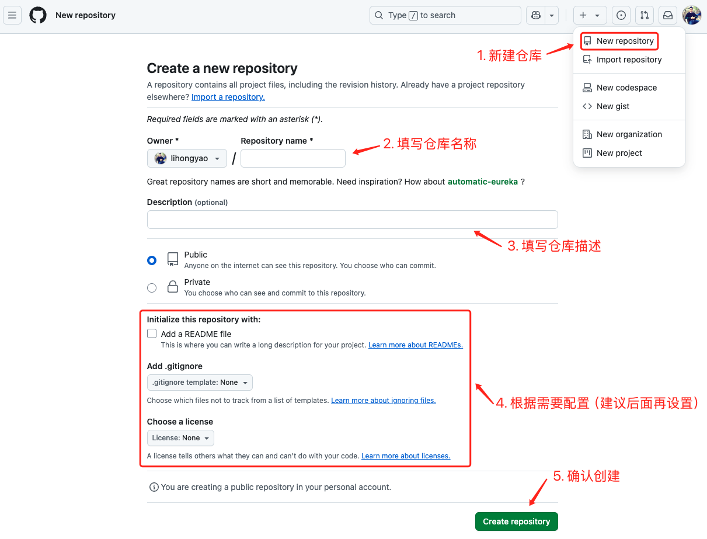
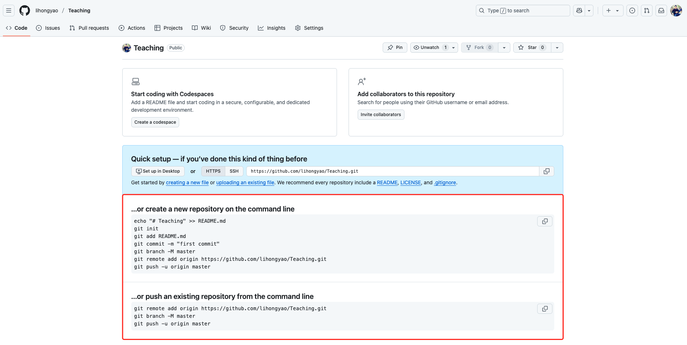

>  参考文献：
>
> 1. <https://git-scm.com/docs>
> 2. <http://www.bootcss.com/p/git-guide/>
> 3. <https://www.runoob.com/manual/github-git-cheat-sheet.pdf>

# Git 概述

## Git

Git 是一款革命性的 **分布式版本控制系统**，它彻底改变了软件开发团队管理代码的方式。与传统的集中式版本控制系统不同，Git 赋予每个开发者完整的代码仓库副本，这意味着您可以在没有网络连接的情况下继续工作，随时随地提交更改、创建分支和查看历史记录。这种分布式架构不仅提高了工作效率，还大大增强了数据安全性 - 即使中央服务器出现故障，每个开发者的本地仓库都保存着完整的项目历史。

Git 的核心在于其独特的数据存储方式。它不像传统系统那样只记录文件差异，而是每次提交都会创建整个项目的快照，并使用加密哈希确保数据的完整性。这种设计让版本回退变得轻而易举，您可以精确回溯到项目历史的任何一个时间点。更令人惊叹的是，Git 的分支系统几乎没有任何开销 - 创建、切换和合并分支的操作瞬间完成，这使得功能开发、bug修复和实验性工作可以完美并行，而不会互相干扰。

在实际应用中，Git 展现出惊人的灵活性。无论是个人开发者管理小型项目，还是跨国团队协作开发复杂系统，Git 都能完美适应。它支持多种工作流程，可以与 GitHub、GitLab 等现代开发平台无缝集成，成为持续集成和持续交付流程的核心组件。正是这些卓越特性，使 Git 从众多版本控制系统中脱颖而出，成为当今软件开发领域不可或缺的标准工具，为数百万开发者提供了高效、可靠的代码管理解决方案。

## Git 诞生

2005年，当Linux内核开发团队突然失去BitKeeper版本控制系统的使用权时，谁也没想到这会催生出一个改变软件开发历史的工具。Linus Torvalds——这位创造了Linux操作系统的天才程序员，面对这个危机展现出了惊人的创造力。

怀着对现有版本控制系统的不满，Linus开始着手设计一个全新的系统。他设想的Git必须满足几个关键要求：它必须是分布式的，让每个开发者都能独立工作；它必须足够高效，能处理像Linux内核这样庞大的项目；最重要的是，它必须完全开源，永远不再受制于商业公司的决策。

在短短几周内，Linus就完成了Git的初始版本。这个新系统采用了革命性的"快照"存储方式，而非传统的差异存储，使得版本控制更加可靠和高效。其轻量级分支设计让代码实验和功能开发变得前所未有的简单。

最初作为Linux内核开发专用工具的Git，很快展现出惊人的潜力。开源社区迅速接纳了这个新工具，GitHub等平台的兴起更使其成为全球开发者的标配。如今，Git已经远远超出了Linus最初的设想，成为软件开发领域最重要的基础设施之一，持续推动着全球协作编程的革新。

## 分布式 VS 集中式

分布式版本控制系统（DVCS）和集中式版本控制系统（CVCS）是两种不同的版本控制系统模型，它们在数据存储和工作流程管理上有所不同。

1️⃣ 数据存储方式

- **集中式（CVCS）**：像图书馆借书
  - 所有代码都存放在中央服务器（类似图书馆总馆）
  - 开发者只能"借出"代码副本，修改后必须"归还"到中央服务器
- **分布式（DVCS）**：人手一本的百科全书
  - 每个开发者电脑上都有完整的代码库和历史记录
  - 可以随时在本地修改和提交，不需要立即同步到中央服务器

2️⃣ 工作方式对比

- **集中式**：必须联网办公
  - 所有操作（提交、查看历史等）都需要连接服务器
  - 服务器宕机=全组停工
  - 适合办公室固定工位的团队
- **分布式**：随时随地工作
  - 本地就能完成大部分操作
  - 没网络也能继续写代码、提交记录
  - 适合远程办公或经常出差的开发者

3️⃣ 团队协作差异

- **集中式**：单一信息中心
  - 所有变更必须经过中央服务器中转
  - 合并代码要排队等待
  - 类似传统的纸质文件审批流程
- **分布式**：点对点协作
  - 开发者之间可以直接交换修改
  - 可以灵活选择何时同步到主仓库
  - 类似现代的云端协作文档

# Git 安装

1. 下载安装包

   - 官方下载地址：https://git-scm.com/download
   - 支持 Windows、macOS 和 Linux 全平台，具体下载方式请参考官方下载指南。

   macOS 用户可以使用 Homebrew 安装

   ```shell
   $ brew install git
   ```

2. 验证安装

   ```shell
   # 查看安装路径
   $ which git        # macOS/Linux
   $ where git        # Windows
   
   # 查看版本号
   $ git --version
   
   # 查看帮助指南
   $ git --help
   ```

3. 基础配置（首次使用必做）

   ```shell
   # 设置全局用户信息（提交时显示）
   $ git config --global user.name "你的名字"
   $ git config --global user.email "你的邮箱"
   
   # 启用彩色终端输出
   $ git config --global color.ui auto
   
   # 优化日志显示格式
   $ git config --global format.pretty "%h - %an, %ar : %s"
   ```

   查看当前配置：

   ```shell
   $ git config --list
   ```

4. 高级配置建议

   ```shell
   # 设置默认编辑器为VSCode
   $ git config --global core.editor "code --wait"
   
   # 启用自动换行转换（跨平台协作时很重要）
   $ git config --global core.autocrlf input  # macOS/Linux
   $ git config --global core.autocrlf true   # Windows
   ```

> **提示**：所有配置保存在 `~/.gitconfig` 文件，可直接编辑

# Git 工作流


Git的工作流程包括以下几个主要步骤：

1. **初始化仓库**

   - `git init`：在本地创建新仓库
   - `git clone`：克隆远程仓库到本地

2. **添加和提交文件**

   - `git add`：把修改加入暂存区
   - `git commit`：提交到本地仓库

3. **分支管理**

   - `git branch`：创建、切换、删除分支
   - 分支可以同时开发新功能或测试

4. **同步远程仓库**

   - `git remote`：添加远程仓库
   - `git push`：上传本地提交
   - `git fetch` / `pull`：获取远程更新

5. **解决冲突**

   - 同时修改同一文件会冲突
   - `git diff` 查看差异，手动解决后 `git add` + `git commit`

6. **版本回退**

   - `git log` 查看历史
   - `git checkout` 回到指定版本
7. **标签管理**
   - `git tag` 标记重要版本或里程碑


# 远程仓库

## 1. 注册账号

远程仓库可以是 [Github](https://github.com/)，也可以是 [码云 Gitee](https://gitee.com/)（推荐国内用户使用），这里以 Github 为例，首先你需要创建一个账号，[点击前往 ↪](https://github.com/signup)

## 2. 配置SSH Key

由于你的本地 Git仓 库和 GitHub 仓库之间的传输是通过 SSH 加密的，所以，需要设置 SSH Key。

**第1步**：创建SSH Key

在用户主目录下，看看有没有 `.ssh` 目录：

```shell
$ ls ~/.ssh
id_rsa		id_rsa.pub
```

如果有，再看看这个目录下有没有 `id_rsa` 和 `id_rsa.pub` 这两个文件，如果已经有了，可直接跳到下一步。

> 提示：macOS 会隐藏 .ssh 目录，可以通过 <kbd>cmd</kbd> + <kbd>shift</kbd> +  <kbd>.</kbd> 快捷键展示隐藏目录。

如果没有，打开 Shell（Windows下打开Git Bash），创建SSH Key： 

```shell
$ ssh-keygen -t rsa -C "你的邮件地址"
```

然后一路回车，使用默认值即可，由于这个 Key 也不是用于军事目的，所以也无需设置密码。

如果一切顺利的话，可以在用户主目录里找到 `.ssh` 目录，里面有 `id_rsa` 和 `id_rsa.pub` 两个文件，这两个就是 SSH Key 的秘钥对。

其中，`id_rsa`  是私钥，不能泄露出去， `id_rsa.pub` 是公钥，可以放心地告诉任何人。

> **提示**：
>
> 在windows系统下，如果出现 “ssh-keygen” 不是内部或外部命令，解决的办法是：
>
> 1. 首先找到 “ssh-keygen” 的安装目录，一般位于 “C:\Program Files\Git\usr\bin” 下。
> 2. 将该路径添加环境变量的Path字段中。

**第2步**：

登录 Github  → 点击右上角个人头像  →  Settings  → SSH and GPG keys  → New SSH Key

在添加面板中，

- `Title`：设置SSH key 标题，可任意填写

- `Key`：将  `id_rsa.pub`  文件内容拷贝至此

然后点击 Add SSH Key 就可以看到你创建的SSH Key了，如下图所示：


为什么 GitHub 需要 SSH Key 呢？因为GitHub需要识别出你推送的提交确实是你推送的，而不是别人冒充的，而Git支持SSH协议，所以，GitHub只要知道了你的公钥，就可以确认只有你自己才能推送。

当然，GitHub允许你添加多个Key。假设你有两台电脑，一台在公司，一台在家里，那你只需要把每台电脑的Key都添加到GitHub，就可以在家里或者在公司推送代码了。

确保你拥有一个GitHub账号后，我们就即将开始远程仓库的学习。 

## 3. 创建远程库

1）登陆GitHub，然后，在右上角找到点击 `+` 按钮，再选择 `New Repository`  创建一个新的仓库：



2）关联远程仓库：



根据是否已有本地仓库来选择关联方式，这里以 **已有本地仓库** 为例：

```shell
# 将远程仓库地址添加到本地 Git 配置中，并命名为 origin
$ git remote add origin https://github.com/LiHongyao/Teaching.git
# 将当前分支重命名为 master（-M 表示强制重命名）
$ git branch -M master
# 将本地 master 分支推送到远程 origin 仓库，-u 参数设置上游跟踪，后续可直接使用 git push 简化操作
$ git push -u origin master
```

3）推送成功后，可以立刻在GitHub页面中看到远程库的内容。从现在起，只要本地作了提交，就可以通过如下命令更新远程仓库：

```shell
$ git push
```

**SSH 警告**

当你第一次使用Git的 `clone` 或者 `push` 命令连接 GitHub 时，会得到一个警告：

```shell
The authenticity of host 'github.com (xx.xx.xx.xx)' can't be established.
RSA key fingerprint is xx.xx.xx.xx.xx.
Are you sure you want to continue connecting (yes/no)?
```

这是因为 Git 使用SSH连接，而 SSH 连接在第一次验证 GitHub 服务器的 Key 时，需要你确认GitHub 的 Ke y的指纹信息是否真的来自GitHub 的服务器，输入 `yes` 回车即可。

Git 会输出一个警告，告诉你已经把 GitHub 的 Key 添加到本机的一个信任列表里了：

```
Warning: Permanently added 'github.com' (RSA) to the list of known hosts.
```

这个警告只会出现一次，后面的操作就不会有任何警告了。

如果你实在担心有人冒充GitHub服务器，输入 `yes` 前可以对照 [GitHub的RSA Key的指纹信息](https://help.github.com/articles/what-are-github-s-ssh-key-fingerprints/) 是否与SSH连接给出的一致。

## 4. 克隆远程库

在终端通过如下指令即可克隆远程仓库：

```shell
$ git clone <仓库地址>
```

Git仓库地址有以下几种形式：

1. HTTP(S)协议：通过HTTP(S)协议访问远程Git仓库。需要具有读取权限。 

   示例：`https://github.com/<username>/<repository>.git`

2. SSH协议：通过SSH协议访问远程Git仓库。需要在远程服务器上设置SSH密钥，并具有对应的读取权限。

    示例：`git@github.com:<username>/<repository>.git`

3. Git协议：使用Git协议访问远程Git仓库。通常使用默认的Git端口（9418）。 

   示例：`git://github.com/<username>/<repository>.git`

当你从远程仓库克隆时，实际上Git自动把本地的 `master` 分支和远程的 `master` 分支对应起来了，并且，远程仓库的默认名称是 `origin`。

要查看远程库的信息，用 `git remote -v`：

```shell
git remote -v
origin	https://github.com/LiHongyao/Blogs.git (fetch)
origin	https://github.com/LiHongyao/Blogs.git (push)
```

上面显示了可以抓取和推送的 `origin` 的地址。如果没有推送权限，就看不到push的地址。

# 分支管理


Git分支是代码开发的独立时间线，本质是指向提交对象的轻量级指针，现代Git默认创建的主分支名为 **main**（之前是 master），作为代码的稳定基线，开发者可随时创建新分支（如`feature/login`）进行隔离开发，每个分支维护独立的提交历史。

核心优势：

1. **并行开发**：团队成员可同时在多个分支上工作，互不干扰
2. **版本控制**：通过`release/v1.0`等分支管理不同版本
3. **安全实验**：在分支尝试新功能，失败可随时丢弃

标准操作流程：

1. 创建分支：`git switch -c new-feature`
2. 开发提交：在分支内自由提交代码
3. 合并回主支：通过`git merge --no-ff`保留合并记录
4. 冲突处理：当多人修改相同代码时需手动解决

## 1. 分支分类

Git常用的分支分类包括以下几种：

1. **主分支** 

   存储生产环境稳定代码，所有发布版本均基于此分支。

   建议命名：`prod-xxx`

2. **开发分支**

   集成功能开发成果的基线分支，日常开发的核心分支。

   建议命名：`dev-xxx`

3. **功能分支**

   开发独立功能或需求，完成后合并回 `dev` 分支。

   建议命名：`feat/xxx`

4. **发布分支**

   准备新版本发布，进行最终测试、版本号更新等。

   建议命名：`release/vX.X.X`。

5. **热修复分支**

   紧急修复生产环境 Bug，从 `prod` 分支创建，修复后合并回 `prod`和 `dev`。

   建议命名：`hotfix/xxx`

6. **标签**

   标记特定版本（如`v1.0.0`），是不可变的版本快照

## 2. 分支管理策略

Git分支管理策略是指团队在协同开发过程中如何使用和管理 Git 分支的一套规则和约定。

分支模型：

- `dev`：日常开发主干
- `release/*`：版本冻结，如 `release/x-v1` `release/x-v2` `release/z-v1`
- `stage`：预发，只部署 release
- `prod`：线上，只来自 release / hotfix
- `feature/*`：新功能，如 `feature/x-v1-login`
- `hotfix/*`：问题修复

关键原则：

```
prod ⬅ stage ⬅ release ⬅ dev
```

发布链必须是干净可控的。

- 强制 PR + Code Review
- 强制打 tag
- 强制版本号规范（语义化版本）

### 规则

```
开发阶段
──────────────

  feature/* 
     │
     ▼
    dev
     │
     ▼
  release/*
     │
     ▼
   stage
     │
     ▼
    prod
     │
     ▼
    tag


紧急修复
──────────────

prod
  │
  ▼
hotfix/*
  │
  ├── ▶ prod
  └── ▶ dev
```

**日常开发**

```
feature/x-v2-login
feature/z-v1-payment
⬇
合入 dev
```

**准备发布**

```
从 dev 拉 release/x-v1
⬇
测试
⬇
合入 stage
⬇
确认
⬇
合入 prod
⬇
打tag x-v1.0.0
```

**紧急修复**

```
prod
  │
  ▼
hotfix/x-1.0.1
  │
  ├── ▶ prod 
  └── ▶ dev
```

### 示意图

```
                        ┌──────────────┐
                        │   feature/*  │
                        └──────┬───────┘
                               │
                               ▼
                          ┌────────┐
                          │  dev   │  ← 所有开发汇总（未来版本）
                          └────┬───┘
                               │
                ┌──────────────┼──────────────┐
                ▼                              ▼
           release/x-v1                  release/z-v2
            （冻结一期）                    （冻结Z版本）
                │                              │
                ▼                              ▼
              stage                          stage
                │                              │
                ▼                              ▼
              prod                           prod
                │
                ▼
               tag
```

# 标签管理

Git 标签是用于给代码库中的特定提交打上有意义的标记，通常用于表示版本号、发布版本或重要的里程碑。

Git 标签管理的主要策略包括：

1. 版本标签：使用标签来表示软件的版本号。一般情况下，版本标签会和发布分支相关联，例如将一个稳定的发布分支打上版本标签，以便跟踪和记录软件的版本历史。
2. 里程碑标签：使用标签来标记项目中的重要里程碑。这些里程碑可以是关键功能的完成、重要的bug修复、重要事件的发生等。里程碑标签可以帮助团队成员追踪项目进展和重要事件的发生时间。
3. 发布标签：使用标签来标记正式发布的版本。发布标签通常与特定的版本号或发布日期相关联，用于标识可供用户下载和使用的软件版本。

Git 标签管理的优势包括：

- 标记重要版本和里程碑，方便跟踪和回溯软件的发展历程。
- 提供可靠的版本控制，确保发布版本的一致性和稳定性。
- 与分支管理结合使用，使版本控制更加灵活和可控。

在使用 Git 标签管理时，一些常用的指令包括：

- 创建：`git tag <tagname>` / `git tag -a <tagname> -m "<message>"`
- 查看：`git tag` / `git show <tagname>`
- 推送：`git push origin <tagname>`
- 删除（本地）：`git tag -d <tagname>`
- 删除（远程）：`git push origin --delete <tagname>`

标签管理的策略可以根据团队的需求和项目的特点进行灵活调整，例如可以设定特定的命名规范、版本号规则、标签注释的格式等，以便更好地组织和管理标签信息。重要的是，团队成员应该遵循一致的标签管理策略，以确保标签的准确性和可维护性。

# 团队协作

## 1. **Collaborators**

项目负责人可通过仓库设置添加协作者：

- 路径：Settings → Access - Collaborators → Add people
- 流程：受邀者通过注册邮箱接收邀请 → 点击View Invitation确认加入

## 2. Fork & Pull request

开源协作流程一般都会使用 `Fork & Pull request` 的模式：

1. 贡献者Fork原仓库到个人账号
2. 在个人副本上独立开发
3. 通过Pull Request向原仓库提交变更请求
4. 原仓库维护者审核后决定是否合并

## 3. Organization & Team

我们可以通过创建组织的形式来实现团队协作，创建组织的流程如下：

1. 用户菜单选择New organization
2. 选择免费计划
3. 填写组织基本信息
4. 创建成功

创建组织之后，你可以：

- 建立多仓库
- 管理成员权限
- 设置团队分组

> **提示**：所有协作方式均保持原仓库独立性，通过权限控制确保代码安全。

# Git 指令大全

## 🧩 基础配置

- 初始化仓库：`git init`
- 配置用户名：`git config --global user.name "你的名字"`
- 配置邮箱：`git config --global user.email "你的邮箱"`
- 查看当前配置：`git config --list`
- 设置默认分支名为 main：`git config --global init.defaultBranch main`
- 忽略大小写：`git config core.ignorecase false`

## 🌿 分支管理

- 查看本地分支：`git branch`
- 查看远程分支：`git branch -r`
- 创建新分支：`git branch feat/login`
- 切换分支：`git checkout feat/login`
- 创建并切换：`git checkout -b feat/login`
- 删除本地分支：`git branch -d feat/login`
- 强制删除分支：`git branch -D feat/login`
- 从远程分支创建新分支：`git checkout -b feat/login origin/prod-br`

## 💾 提交与暂存

- 查看状态：`git status`
- 添加全部修改：`git add .`
- 添加指定文件：`git add src/index.ts`
- 从暂存区撤回：`git restore --staged 文件名`
- 提交修改：`git commit -m "feat: 新增登录功能"`
- 修改上次提交信息：`git commit --amend -m "fix: 优化登录逻辑"`
- 跳过校验提交：`git commit -n -m "临时提交"`

## 🌍 远程操作

- 查看远程仓库：`git remote -v`
- 添加远程仓库：`git remote add origin git@github.com:xxx/repo.git`
- 修改远程地址：`git remote set-url origin 新地址`
- 获取远程更新（不合并）：`git fetch origin`
- 拉取并合并远程分支：`git pull origin prod-br`
- 推送分支到远程：`git push origin feat/login`
- 强制推送：`git push origin feat/login -f`
- 删除远程分支：`git push origin --delete feat/login`

## 🔀 合并与变基

- 合并分支：`git merge prod-br`
- 拉取远程并合并：`git pull origin prod-br`
- 变基到 prod-br：`git rebase prod-br`
- 交互式变基：`git rebase -i HEAD~5`
- 变基出错中止：`git rebase --abort`
- 冲突解决后继续：`git rebase --continue`
- 放弃当前合并：`git merge --abort`

## 🧹 回退与撤销

- 撤销未暂存修改：`git restore 文件名`
- 回退到上一次提交（保留代码）：`git reset --soft HEAD~1`
- 回退到上一次提交（丢弃修改）：`git reset --hard HEAD~1`
- 回退到指定提交：`git reset --hard commit_id`
- 生成“撤销”提交：`git revert commit_id`
- 查看提交日志：`git log --oneline --graph --decorate`

## 📦 暂存与恢复（stash）

- 保存当前修改：`git stash`
- 保存并添加备注：`git stash push -m "修复登录页"`
- 查看暂存列表：`git stash list`
- 恢复最近一次暂存（保留 stash）：`git stash apply`
- 恢复并删除暂存：`git stash pop`
- 清空所有暂存：`git stash clear`

## 🧭 标签管理

- 查看标签：`git tag`
- 创建轻量标签：`git tag v1.0.0`
- 创建带备注标签：`git tag -a v1.0.0 -m "首个发布版本"`
- 推送单个标签：`git push origin v1.0.0`
- 推送所有标签：`git push origin --tags`
- 删除本地标签：`git tag -d v1.0.0`
- 删除远程标签：`git push origin :refs/tags/v1.0.0`

## 🧠 常见工作流场景

- 从远程分支拉新分支开发：`git checkout -b feat/xxx origin/prod-br`
- 保持当前分支最新：`git fetch origin && git merge origin/prod-br`
- 提测前整理提交：`git rebase -i origin/prod-br`
- 冲突解决后继续变基：`git add . && git rebase --continue`
- 提交并推送远程：`git commit -m "feat: 新增功能" && git push origin feat/xxx`
- 临时切任务保存修改：`git stash push -m "当前任务保存" && git checkout prod-br`
- 恢复工作并继续开发：`git stash pop`

## 🧩 查看与调试

- 查看文件提交历史：`git log --follow 文件名`
- 查看两次提交差异：`git diff commit1 commit2`
- 查看暂存区与工作区差异：`git diff --cached`
- 查看当前 HEAD 指向：`git show HEAD`
- 对比远程与本地差异：`git fetch origin && git diff origin/prod-br`

# 扩展

## 可视化工具

- **GitHub Desktop**：[官方下载](https://desktop.github.com/)
- **GitKraken**：跨平台Git客户端
- **SourceTree**：免费的Git GUI工具

## GitHub Pages

[Github page](https://pages.github.com/) 是一个免费的静态网页托管服务，您可以使用 Gitee Pages 托管博客、项目官网等静态网页

具体操作如下：

第1步：创建一个仓库，命名为：`<username>.github.io`，比如：`zhangsan.github.io`

第2步：上传静态文件到仓库根目录或子目录，比如：`zhangsan.github.io/www`

第3步：浏览器输入地址：https://zhangsan.github.io/www/index.html

## 国内代码托管

| 平台        | 网址                             | 特点                     |
| ----------- | -------------------------------- | ------------------------ |
| 码云(Gitee) | [gitee.com](https://gitee.com)   | 国内访问快，企业级功能   |
| Coding      | [coding.net](https://coding.net) | 腾讯云旗下，DevOps全流程 |

## 取消跟踪

实际开发中，你可能不小心将 `node_modules` 或一些缓存文件提交至了远程仓库从而导致文件体积特别大，最终导致 `push/pull` 时特别慢。这个时候我们就需要取消Git对该文件的追踪啦。

1. 查看当前指定分支下追踪的文件（非必须）：

   ```shell
   $ git ls-tree -r master --name-only
   ```

2. 停止追踪但不删除文件：

   ```shell
   $ git rm -r --cached <file_or_dir>
   ```

3. 更新 .ignore

   ```shell
   $ echo "<file_or_dir>" >> .gitignore
   ```

4. 提交变更

   ```shell
   $ git add .gitignore
   $ git commit -m "停止追踪文件"
   $ git push
   ```

## 分支冲突解决流程

1. 拉取最新代码：

   ```shell
   $ git fetch origin
   ```

2. 设置上游分支（首次需要）：

   ```shell
   $ git branch --set-upstream-to=origin/<branch> <branch>
   ```

3. 合并代码：

   ```shell
   $ git merge origin/<branch>
   ```

4. 解决冲突后提交：

   ```shell
   $ git add .
   $ git commit -m "解决合并冲突"
   $ git push
   ```

## 同步Fork仓库

如果Fork源仓库更新了内容，要更新Fork之后的内容，操作如下：

```bash
# 1. 查看远程信息
$ git remote -v

# 2. 添加上游仓库（Fork 的仓库）
$ git remote add upstream <original_repo_url>(Fork 源仓库地址)

# 3. 获取更新
$ git fetch upstream

# 4. 合并到本地
$ git merge upstream/main

# 5. 推送到自己的仓库
$ git push origin main
```

## git fetch vs. git pull


`git fetch` 和 `git pull` 是 Git 中用于获取远程代码更新的两个命令，它们之间的区别如下：

- `git fetch`：执行 `git fetch` 命令会从远程仓库下载最新的提交和分支信息，但不会自动合并或更新本地分支。它只是将远程仓库的内容下载到本地，并更新远程分支的引用。可以理解为将远程仓库的代码更新拉取到本地的一个暂存区域，但不会直接影响当前工作区的代码。可以通过 `git fetch origin <branch>` 指定特定的分支进行更新。
- `git pull`：执行 `git pull` 命令会从远程仓库下载最新的提交和分支信息，并尝试自动合并或更新当前分支。它包含了 `git fetch` 和 `git merge` 两个步骤，先将远程仓库的代码更新拉取到本地，然后自动执行合并操作，将远程分支的更新应用到当前分支。如果当前分支有未提交的修改，可能会导致合并冲突。

综上所述，`git fetch` 主要用于获取远程仓库的最新代码，而不会自动合并或更新当前分支，适合在查看远程更新、比较分支差异等情况下使用。而 `git pull` 则会自动合并远程分支的更新到当前分支，适合在需要及时同步远程更新并自动合并的情况下使用。

需要注意的是，使用 `git pull` 命令时，如果当前分支有未提交的修改，可能会导致合并冲突。在执行 `git pull` 之前，建议先提交或保存当前分支上的修改，以避免可能的冲突。

## git stash pop vs. git stash apply

`git stash pop` 和 `git stash apply` 是 Git 中用于恢复暂存的工作区修改的两个命令，它们之间的区别如下：

- `git stash pop`：执行 `git stash pop` 命令会从暂存堆栈中恢复最近一次的暂存，并将恢复的修改应用到当前工作区。同时，该恢复的暂存记录会从暂存堆栈中移除。如果有多个暂存记录，`git stash pop` 会自动恢复最新的记录。
- `git stash apply`：执行 `git stash apply` 命令会从暂存堆栈中恢复最近一次的暂存，并将恢复的修改应用到当前工作区。与 `git stash pop` 不同的是，`git stash apply` 不会移除恢复的暂存记录，仍然保留在暂存堆栈中。如果有多个暂存记录，需要通过指定索引来选择恢复特定的记录。

总结来说，`git stash pop` 和 `git stash apply` 的作用是相同的，都用于从暂存堆栈中恢复修改。不同之处在于 `git stash pop` 在恢复修改后会自动将该暂存记录从堆栈中移除，而 `git stash apply` 则保留该暂存记录。选择使用哪个命令取决于你的需求，如果你希望在恢复修改后将暂存记录从堆栈中删除，可以使用 `git stash pop`；如果希望保留暂存记录以备将来使用，可以使用 `git stash apply`。

## VS Code git 管理工具

推荐阅读 https://juejin.cn/post/7426319406357020707

# 常见问题

1. **fatal: protocol error: bad pack header**

   ```sh
   $ git config --global pack.windowMemory 256m
   ```

2. **error: RPC failed; curl 56 OpenSSL SSL_read: Connection was reset, errno 10054**

   ```markdown
   # 原因：被墙了
   # 解决：
   1. 获取ip
   访问
   https://fastly.net.ipaddress.com/github.global.ssl.fastly.net#ipinfo 
   获取cdn域名以及IP地址
   
   访问 
   https://github.com.ipaddress.com/#ipinfo
   获取cdn域名以及IP地址
   2. 将域名与获取的ip添加映射关系
   # fix git clone github project failed
   199.232.69.194 github.global.ssl.fastly.net
   140.82.114.4 github.com
   添加到 windows中的 C:\Windows\System32\drivers\etc\hosts 文件中；
   
   3. 然后cmd命令窗口中执行下列命令刷新dns
   ipconfig /flushdns
   ```

3. **unable to access..., errno [502,10053]**

   fatal: unable to access '': OpenSSL SSL_read: Connection was aborted, errno 10053

   fatal: unable to access '': The requested URL returned error: 502

   ```shell
   git config --global --unset http.proxy 
   git config --global --unset https.proxy
   ```

   由于网络原因，可能需要多次重试：git push 指令

4. **fatal: unable to access: OpenSSL SSL_read: Connection was reset, errno 10054**

   ```shell
   git config --global http.sslVerify "false"
   ```

5. **fatal: The remote end hung up unexpectedly error: failed to push some refs to**

   ```shell
   git push origin master
   ```

6. **fatal: unable to access : LibreSSL SSL_connect: SSL_ERROR_SYSCALL in connection to github.com:443** 

   ```shell
   git config --global --unset http.proxy
   ```


7. **fatal: unable to access : Failed to connect to github.com port 443 after 2086 ms: Connection refused**

   ```shell
   git config --global http.proxy http://127.0.0.1:1080
   git config --global https.proxy http://127.0.0.1:1080
   ```

# VS Code 源代码管理

在开发中，可以使用 VS Code **源代码管理** 工具来管理你的git，避免使用指令犯错的可能，同时提高效率。

你可以通过快捷键 <kbd>Control</kbd> + <kbd>Shift</kbd> + <kbd>G</kbd> 打开 源代码管理。

参考阅读：[在 VS Code 中使用 Git 源代码管理 ↪](https://vscode.github.net.cn/docs/sourcecontrol/overview)

# 扩展

## 单仓库多品牌多版本分支管理策略

一套代码，开发 `x` `z` 项目，其中 `x` 又有一期/二期同步开发，一期先发布，二期晚发布。`z` 也是同步开发。

### 1. 分支结构

```
main              —— 生产线，长期稳定，所有上线版本必须在这里打 tag 发布，只接受 hotfix / release/*
dev               —— 开发线，长期稳定，负责未来集成
dev‑x‑vN          —— 版本集成分支，用于隔离不同项目版本的并行开发，如 dev-x-v1 dev-x-v2 dev-z-v1
feature/*         —— 功能分支，由版本集成分支迁出，并最终合入版本集成分支，如 feature/x-deposit
release/*         —— 用于发布候选、Bug 修复、体验服/测试等，后面发测试环境/体验服均从该分支发布，如 release/x-v1
hotfix/*          —— 用于生产线紧急修复
```

### 2. 流程图

下面是每一种分支的生命周期和它们之间的关系：

```
main (生产)
   ↑       ↑
   |       | merge finish release
   |       | (tag vX.Y.Z)
release/x-v1
   ↑
   | fork from
dev-x-v1  (版本集成线)
   ↑   \        
   |    \── feature/x-v1-login
   |     \── feature/x-v1-deposit
develop 
   ├── dev-y-v1
   ├── dev-z-v1
   └── ...
```

### 3. 完整步骤

**✅ 步骤 1 — 初始化主线**

```
git checkout main
git checkout -b develop
git push origin develop
```

**✅ 步骤 2 — 版本线启动**

当需要做一个大版本（比如 x-v1）时：

```
git checkout develop
git checkout -b dev-x-v1
git push origin dev-x-v1
```

这样就创建了版本集成分支 **dev-x-v1**。

**为什么这么做？**

✔ 避免直接在 develop 上堆积多个项目（X/Y/Z）未完成功能

✔ 主干持续干净

**✅ 步骤 3 — Feature 分支开发**

团队开发者按任务创建 feature 分支：

```
git checkout dev-x-v1
git checkout -b feat/x-v1-login
```

开发完成后：

✔ 提 PR 合并到 **dev-x-v1**

冲突提前同步策略：

```
git fetch
git merge origin/dev-x-v1
```

**✅ 步骤 4 — dev-x-v2 / z 新版本继续**

当 X-v1 功能还没合完但 X-v2 已启动：

```
git checkout develop
git checkout -b dev-x-v2
git push origin dev-x-v2
```

✔ 只包含 develop 当前稳定内容

✔ 不受其他未完成 feature 干扰

对 Y/Z 也是一样：

```
git checkout develop
git checkout -b dev-y-v1
```

**✅ 步骤 5 — 发布准备（最关键）**

当 **dev-x-v1** 达到可发布标准时：

```
git checkout dev-x-v1
git merge origin/develop
git checkout -b release/x-v1
git push origin release/x-v1
```

至此：

✔ release/x-v1 只能修复 Bug 或 meta 调整（版本号、文档等）

✔ 不再合入新 feature

**✅ 步骤 6 — 测试 / 体验服**

在 **release/x-v1** 分支上：

✔ QA 修复 Bug → 直接 commit

✔ 体验服也从 release/x-v1 发布

这种方式：

- 保证测试环境只含准备发布的功能

- 不污染其他版本线开发

**✅ 步骤 7 — 正式发布**

测试通过后：

```
git checkout main
git merge release/x-v1
git tag vX.Y.Z
git push origin main --tags
```

✔ 在 main 上打 tag

✔ 生产部署就根据 tag 发布

**✅ 步骤 8 — 同步回 develop**

发布后：

```
git checkout develop
git merge release/x-v1
```

✔ 确保后续开发集成了测试修复

✔ 防止未来版本出现重复 Bug

**✅ 步骤 9 — 分支清理**

发布结束后：

```
git branch -d dev-x-v1
git push origin --delete dev-x-v1

git branch -d release/x-v1
git push origin --delete release/x-v1
```

✔ 保持仓库整洁

✔ 不丢失历史（release 已打 tag）

### 4. Hotfix 逻辑（紧急修复）

当线上发现紧急问题：

```
git checkout main
git checkout -b hotfix/x-v1.0.1
```

修复完成后：

✔ 合并到 main → 打 tag → 上线

✔ 再合并到 develop 和当前 release 线

这保证了主线生产修复和后续版本都有这些修复。

### 5. 辅助规范

✔ **PR 审核流程**

所有合并到 dev-x-vN / release / main 都必须走 PR 审核。

✔ **分支保护策略**

保护 main、develop、release/ 分支，禁止直接 push。

✔ **及时同步**

✔ **命名规范**：

```
dev-project-version       e.g. dev-x-v1.0.0
release/project-version   e.g. release/x-1.0.0
feat/project-id           e.g. feat/x-X0001
hotfix/project-version    e.g. hotfix/x-1.0.1
```

### 6. 公共代码

当有公共代码需要及时同步到各版本分支（`dev-x-v1` / `dev-y-v1`）时，直接在 develop 分支上操作，每个正在开发的版本分支应该尽快把这些改动合入，如：

```
git checkout dev-x-v1
git fetch origin
git merge origin/develop
# 解决冲突
git push origin dev-x-v1
```

### 7. 什么时候把 develop 的共享更改合入版本分支？

以下是常见的 Merge 时机：

✔ **每次提交公共更改后及时同步**

只要 develop 有公共更改，就应该定期把这些合入活动的版本分支

✔ **每周或每天做一次版本分支与 develop 互相 merge**

这样可以减少大冲突的累积

✔ **在版本切 release 前特别合并一次**

提前解决跨版本冲突，release 则在这个基础上创建

