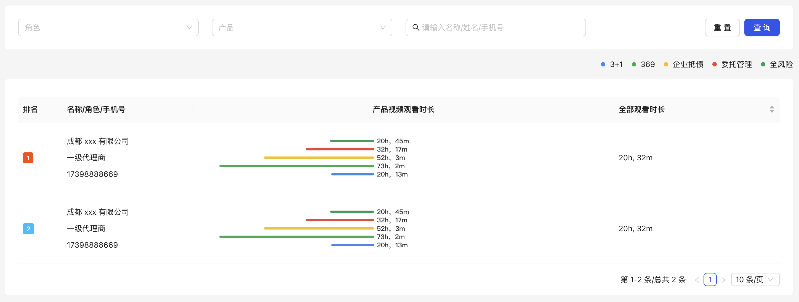

# 概述

在前端大屏可视化开发中，选择合适的图表框架至关重要。当前市面上有许多优秀的可视化框架，例如 **Apache ECharts** 和 **AntV**，它们各自具备独特的优势。经过综合考量，我最终选择了 **Apache ECharts**，原因在于其丰富的图表类型、强大的交互能力、完善的文档支持以及广泛的社区资源。此外，ECharts 的性能优化和跨平台兼容性也使其成为大屏可视化项目的理想选择。

[**Apache ECharts**](https://echarts.apache.org/zh/index.html) 是一个功能强大、易于使用的前端可视化库，支持丰富的图表类型和高度定制化，广泛应用于数据展示和大屏可视化场景。

目前开发中我主要是 React 开发，所以后面我主要基于 `echarts-for-react` 去给大家介绍 echarts 的基本使用。

# 安装

```shell
$ pnpm add echarts-for-react echarts echarts-gl
```

# 示例

## 显示地图

工具：

1. [经纬度拾取器 ↪](https://lbs.qq.com/tool/getpoint/getpoint.html)
2. [阿里云 DataV ↪](https://datav.aliyun.com/portal/school/atlas/area_selector)：获取地图 GeoJSON 数据

效果：

实现：

1）从 **阿里云 DataV** 下载中国的 GeoJSON 数据，保存为 `china.json`。

2）示例代码：

```tsx
import * as echarts from "echarts";
import { memo, useEffect, useRef } from "react";
import geo_city from "./geo_city.json";
import geo_country from "./geo_country.json";
import geo_province from "./geo_province.json";
import type { GeoJSON } from "echarts/types/src/coord/geo/geoTypes.js";
interface GeoRoamParams {
  type: "georoam"; // 固定事件类型标识
  componentType: "geo" | "series"; // 触发事件的组件类型
  seriesId?: string; // 系列ID（可选）

  // 缩放相关参数
  zoom: number; // 单次缩放倍数（从v5.5.1开始提供totalZoom替代）
  totalZoom: number; // 累计缩放倍数（v5.5.1+）

  // 平移相关参数
  originX?: number; // 缩放原点X坐标（相对容器）
  originY?: number; // 缩放原点Y坐标（相对容器）
  dx?: number; // 拖拽水平位移量（仅拖拽时存在）
  dy?: number; // 拖拽垂直位移量（仅拖拽时存在）

  // 动作类型（部分版本可能包含）
  action?: "zoom" | "drag"; // 区分缩放或拖拽
}

echarts.registerMap("china-country", geo_country as GeoJSON);
echarts.registerMap("china-province", geo_province as GeoJSON);
echarts.registerMap("china-city", geo_city as GeoJSON);

const data = [
  { name: "北京", coord: [116.404, 39.915], count: 150 },
  { name: "上海", coord: [121.4737, 31.2304], count: 130 },
  { name: "西安", coord: [108.934937, 34.271971], count: 130 },
  { name: "重庆", coord: [106.495972, 29.562707], count: 130 },
  { name: "成都", coord: [104.139404, 30.647364], count: 130 },
  { name: "广州", coord: [113.26, 23.13], count: 130 },
];

export default memo(function ChinaMap() {
  const container = useRef<HTMLDivElement | null>(null);
  const echartsRef = useRef<echarts.ECharts | null>(null);

  const createMapOption = (mapType: string) => {
    const baseOption: echarts.EChartsOption = {
      backgroundColor: "#333",
      grid: { top: 0, left: 0, right: 0, bottom: 0 },
      // tooltip: { trigger: 'item' },
      series: [
        {
          type: "map",
          map: mapType, // 必须与registerMap的名称一致
          roam: true, // 保留缩放拖拽功能但固定初始状态
          zoom: 4, // 初始缩放级别
          center: [104.066128, 30.572924], // 固定地图中心点坐标（经度,纬度） —— 成都
          layoutCenter: ["50%", "60%"], // 地图在容器中的位置居中
          layoutSize: "100%", // 地图占满容器
          label: { show: true, color: "#ccc" },
          selectedMode: false, // 禁用选中功能
          animation: false, // 禁用动画
          itemStyle: {
            // -- 地图区域填充颜色
            areaColor: "#182027",
            // -- 区域边界线颜色
            borderColor: "#0a1116",
            // -- 区域边界线粗细
            borderWidth: 2,
          },
          emphasis: {
            itemStyle: {
              // -- 地图区域填充颜色
              areaColor: "transparent",
              // -- 区域边界线颜色
              borderColor: "#99999950",
              // -- 区域边界线粗细
              borderWidth: 2,
            },
            label: { show: true, color: "#f5f5f5" },
          },
          markPoint: {
            label: {
              show: true,
              formatter: (params: any) => params.data.count,
              color: "#fff",
              fontSize: 12,
              fontWeight: "bolder",
            },
            // 根据地图类型显示不同标记点
            data: data?.map((item: any) => ({
              name: item.name,
              coord: item.coord,
              count: item.count,
              itemStyle: {
                color: "#888",
              },
            })),
          },
        },
      ],
    };
    return baseOption;
  };

  useEffect(() => {
    if (container.current) {
      // 基于准备好的dom，初始化echarts实例
      echartsRef.current = echarts.init(container.current);
      // 绘制图表
      echartsRef.current.setOption(createMapOption("china-province") as echarts.EChartsOption);
      // 事件监听
      echartsRef.current.on("georoam", (params: unknown) => {
        const roamParams = params as GeoRoamParams;
        const currentZoom = roamParams.totalZoom;
        const option = echartsRef.current?.getOption();
        if (!option) return;
        // 根据缩放级别切换地图
        if (currentZoom < 0.5) {
          (option.series as any)[0].map = "china-country";
        } else if (currentZoom < 6) {
          (option.series as any)[0].map = "china-province";
        } else {
          (option.series as any)[0].map = "china-city";
        }
        echartsRef.current?.setOption(option);
      });
    }
    return () => {
      echartsRef.current?.dispose();
    };
  }, []);
  
  useEffect(() => {
    if (data && data.length > 0) {
      const option = echartsRef.current?.getOption();
      if (!option) return;
      (option.series as any)[0].markPoint.data = data
        .filter((item: any) => {
          return !!item.coord;
        })
        .map((item: any) => {
          return {
            name: item.name,
            coord: item.coord,
            count: item.count,
            itemStyle: {
              color: '#888',
            },
          };
        });
      echartsRef.current?.setOption(option);
    }
  }, [data]);

  useEffect(() => {
    const handleResize = () => {
      echartsRef.current?.resize();
    };

    window.addEventListener("resize", handleResize);
    return () => window.removeEventListener("resize", handleResize);
  }, []);

  return <div ref={container} className="w-full h-full" />;
});

```

## 柱状图 - 产品贡献


```react
import * as echarts from "echarts";
import { memo, useEffect, useRef } from "react";

const colorList = [
  "#4285F4",
  "#34A853",
  "#FBBC05",
  "#EA4335",
  "#0F9D58",
  "#FF6D00",
  "#7B1FA2",
  "#00ACC1",
  "#D81B60",
  "#43A047",
  "#5C6BC0",
  "#E53935",
  "#00897B",
  "#3949AB",
  "#F4511E",
  "#039BE5",
  "#8E24AA",
  "#C0CA33",
  "#6D4C41",
  "#E91E63",
];

const data = [
  { name: "3+1", value: 120 },
  { name: "369", value: 80 },
  { name: "企业抵债", value: 150 },
  { name: "委托管理", value: 90 },
  { name: "全风险", value: 200 },
];

export default memo(function HorizontalBarChart() {
  const container = useRef<HTMLDivElement | null>(null);
  const echartsRef = useRef<echarts.ECharts | null>(null);

  // 动态计算容器高度（基于柱条数量、高度和间距）
  const barHeight = 4; // 每条柱子的高度
  const barGap = 10; // 柱子之间的间距
  const chartHeight = data.length * (barHeight + barGap) + barGap; // 总高度

  const renderTooltip = () => {
    return `
    <div style="background-color: #eff6fd; position: relative; z-index: 100; ">
        <div style="display: flex; flex-direction: column; gap: 6px; margin-top: 6px">
          ${(() => {
            return data
              .map((item, index) => {
                return `
                <div style="display: flex; justify-content: space-between; gap: 24px; background: #fff; padding: 6px 12px; border-radius: 6px;">
                  <div style="display: flex; align-items: center; gap: 6px;">
                    <div style="width:10px; height: 10px; border-radius: 50%; background-color: ${colorList[index]};"></div>
                    <div>${item.name}</div>
                  </div>
                  <div style="color: #000; font-weight: bold;">${item.value} 元</div>
                </div>`;
              })
              .join("");
          })()}
        </div>
    </div>
    `;
  };

  useEffect(() => {
    if (container.current) {
      // 基于准备好的dom，初始化echarts实例
      echartsRef.current = echarts.init(container.current);
      // 绘制图表
      echartsRef.current.setOption({
        grid: { top: barGap, bottom: barGap },
        xAxis: { show: false },
        yAxis: { show: false, type: "category" },
        tooltip: {
          trigger: "axis",
          backgroundColor: "#eff5fd",
          borderWidth: 0,
          formatter: () => renderTooltip(),
        },
        series: [
          {
            type: "bar",
            barWidth: barHeight,
            barCategoryGap: `${barGap}px`,
            silent: false,
            data: data.map((item) => item.value),
            itemStyle: {
              color: (params) => colorList[params.dataIndex],
              borderRadius: 4,
            },
            label: { show: false },
          },
        ],
      } as echarts.EChartsOption);
    }
    return () => {
      echartsRef.current?.dispose();
    };
  }, []);

  return <div ref={container} style={{ height: `${chartHeight}px`, width: "100%" }} />;
});

```

## 柱状图 - 产品观看时长



```react
import * as echarts from "echarts";
import { memo, useEffect, useRef } from "react";

const colorList = [
  "#4285F4",
  "#34A853",
  "#FBBC05",
  "#EA4335",
  "#0F9D58",
  "#FF6D00",
  "#7B1FA2",
  "#00ACC1",
  "#D81B60",
  "#43A047",
  "#5C6BC0",
  "#E53935",
  "#00897B",
  "#3949AB",
  "#F4511E",
  "#039BE5",
  "#8E24AA",
  "#C0CA33",
  "#6D4C41",
  "#E91E63",
];

const data = [
  { name: "3+1", value: 1213 },
  { name: "369", value: 4382 },
  { name: "企业抵债", value: 3123 },
  { name: "委托管理", value: 1937 },
  { name: "全风险", value: 1245 },
];

export default memo(function HorizontalBarXChart() {
  const container = useRef<HTMLDivElement | null>(null);
  const echartsRef = useRef<echarts.ECharts | null>(null);

  /// 动态计算容器高度（基于柱条数量、高度和间距）
  const barHeight = 4; // 每条柱子的高度
  const barGap = 10; // 柱子之间的间距
  const chartHeight = data?.length * (barHeight + barGap) + barGap; // 总高度

  const f = (value: number) => {
    // 将数值转换为h,m格式
    const hours = Math.floor(value / 60);
    const minutes = value % 60;
    return hours > 0 ? `${hours}h，${minutes}m` : `${minutes}m`;
  };

  useEffect(() => {
    if (container.current) {
      // 基于准备好的dom，初始化echarts实例
      echartsRef.current = echarts.init(container.current);
      // 绘制图表
      echartsRef.current.setOption({
        grid: { top: barGap, right: 80, bottom: barGap },
        xAxis: {
          type: "value",
          inverse: true, // 从右向左延伸
          show: false,
          axisLine: { show: false }, // 隐藏轴线
          axisTick: { show: false }, // 隐藏刻度线
          axisLabel: { show: false }, // 隐藏数值标签
          splitLine: { show: false }, // 关键：移除垂直刻度线
        },
        yAxis: { type: "category", show: false },
        tooltip: { show: false },
        series: [
          {
            type: "bar",
            barWidth: barHeight,
            barCategoryGap: `${barGap}px`,
            silent: false,
            data: data?.map((item) => item.value),
            itemStyle: {
              color: (params) => colorList[params.dataIndex],
              borderRadius: 4,
            },
            label: {
              show: true,
              position: "right",
              fontWeight: "bold",
              formatter: (params) => f(params.data as number),
            },
          },
        ],
      } as echarts.EChartsOption);
    }
    return () => {
      echartsRef.current?.dispose();
    };
  }, []);

  return <div ref={container} style={{ height: `${chartHeight}px`, width: "100%" }} />;
});

```


## 柱状图 - 分组


```react
import * as echarts from "echarts";
import type { CallbackDataParams } from "echarts/types/dist/shared";
import { memo, useEffect, useRef } from "react";

const data = {
  months: ["1月", "2月", "3月", "4月", "5月", "6月", "7月", "8月", "9月", "10月", "11月", "12月"],
  series: [
    {
      name: "一级代理商",
      data: [120, 132, 101, 134, 90, 230, 210, 120, 132, 101, 134, 90],
    },
    {
      name: "准一级代理商",
      data: [220, 182, 191, 234, 290, 330, 310, 220, 182, 191, 234, 290],
    },
    {
      name: "二级代理商",
      data: [150, 232, 201, 154, 190, 330, 410, 150, 232, 201, 154, 190],
    },
    {
      name: "合伙人",
      data: [320, 332, 301, 334, 390, 330, 320, 320, 332, 301, 334, 390],
    },
  ],
};

export default memo(function HorizontalBarChart() {
  const container = useRef<HTMLDivElement | null>(null);
  const echartsRef = useRef<echarts.ECharts | null>(null);

  useEffect(() => {
    if (container.current) {
      // 基于准备好的dom，初始化echarts实例
      echartsRef.current = echarts.init(container.current);
      // 绘制图表
      echartsRef.current.setOption({
        title: { text: "年度代理商数量", left: "center", top: "0%" },
        grid: { top: 35 },
        tooltip: {
          trigger: "axis",
          backgroundColor: "#eff5fd",
          borderWidth: 0,
          axisPointer: { type: "shadow" },
          formatter: (params: Array<CallbackDataParams>) => {
            return `
              <div style="background-color: #eff6fd; ">
                <div style="font-size: 14px; color: #666; font-weight: bold">${params[0].name}</div>
                <div style="display: flex; flex-direction: column; gap: 6px; margin-top: 6px">
                  ${(() => {
                    return params
                      .map((item) => {
                        return `<div style="display: flex; justify-content: space-between; gap: 24px; background: #fff; padding: 6px 12px; border-radius: 8px;">
                          <div>${item.marker} ${item.seriesName}</div>
                          <div style="color: #000; font-weight: bold;">${item.value} 元</div>
                        </div>`;
                      })
                      .join("");
                  })()}
                </div>
              </div>`;
          },
        },
        legend: { data: data.series.map((item) => item.name), top: 40 },
        xAxis: { type: "category", data: data.months },
        yAxis: { show: false },
        series: data.series.map((item) => ({
          type: "bar",
          barCategoryGap: 10,
          name: item.name,
          data: item.data,
        })),
        dataZoom: [
          {
            type: "slider", // 滑动条型数据区域缩放
            show: true, // 显示滚动条
            xAxisIndex: 0, // 控制第一个x轴
            start: 0, // 初始显示范围的起始百分比（0%）
            end: 50, // 初始显示范围的结束百分比（20%，即默认展示前20%的数据）
            height: 20, // 滚动条高度
            bottom: 10, // 距离容器底部的距离
            filterMode: "filter", // 过滤数据点，提升性能
          },
          {
            type: "inside", // 内置型缩放，支持鼠标滚轮或触屏缩放
            xAxisIndex: 0,
            zoomOnMouseWheel: true, // 允许鼠标滚轮缩放
            moveOnMouseMove: true, // 拖动平移
          },
        ],
      } as echarts.EChartsOption);
    }
    return () => {
      echartsRef.current?.dispose();
    };
  }, []);

  useEffect(() => {
    const handleResize = () => {
      echartsRef.current?.resize();
    };

    window.addEventListener("resize", handleResize);
    return () => window.removeEventListener("resize", handleResize);
  }, []);

  return <div ref={container} className="w-full h-full" />;
});

```

## 折线图

```tsx
import type { EChartsOption } from 'echarts';
import ReactECharts from 'echarts-for-react';

export default function Line() {
  // 定义 ECharts 配置
  const options: EChartsOption = {
    title: {
      text: '折线图示例',
    },
    tooltip: {
      trigger: 'axis',
    },
    xAxis: {
      type: 'category',
      data: ['周一', '周二', '周三', '周四', '周五', '周六', '周日'],
    },
    yAxis: {
      type: 'value',
    },
    series: [
      {
        name: '销量',
        type: 'line',
        data: [150, 230, 224, 218, 135, 147, 260],
      },
    ],
  };

  return (
    <ReactECharts option={options} style={{ height: '100%', width: '100%' }} />
  );
}
```

## 折线图—区域


```react
import * as echarts from "echarts";
import type { CallbackDataParams } from "echarts/types/dist/shared";
import { memo, useEffect, useRef } from "react";

const data = {
  dates: ["2025/10/01", "2025/10/02", "2025/10/03", "2025/10/04", "2025/10/05", "2025/10/06", "2025/10/07"],
  products: [
    {
      name: "3+1",
      data: [120, 132, 101, 134, 90, 230, 210],
    },
    {
      name: "369",
      data: [220, 182, 191, 234, 290, 330, 310],
    },
    {
      name: "企业抵债",
      data: [150, 232, 201, 154, 190, 330, 410],
    },
    {
      name: "委托管理",
      data: [320, 332, 301, 334, 390, 330, 320],
    },
    {
      name: "全风险",
      data: [820, 932, 901, 934, 1290, 1330, 1320],
    },
  ],
};

export default memo(function AreaLineChat() {
  const container = useRef<HTMLDivElement | null>(null);
  const echartsRef = useRef<echarts.ECharts | null>(null);

  useEffect(() => {
    if (container.current) {
      // 基于准备好的dom，初始化echarts实例
      echartsRef.current = echarts.init(container.current);
      // 绘制图表
      echartsRef.current.setOption({
        title: { text: "年度代理商数量", left: "center", top: "0%" },
        grid: { top: 100 },
        tooltip: {
          trigger: "axis",
          backgroundColor: "#eff5fd",
          borderWidth: 0,
          formatter: (params: CallbackDataParams[]) => {
            return `
              <div style="background-color: #eff6fd; ">
                <div style="font-size: 14px; color: #666; font-weight: bold">${params[0].name}</div>
                <div style="display: flex; flex-direction: column; gap: 6px; margin-top: 6px">
                  ${(() => {
                    return params
                      .map((item) => {
                        return `<div style="display: flex; justify-content: space-between; gap: 24px; background: #fff; padding: 6px 12px; border-radius: 8px;">
                          <div>${item.marker} ${item.seriesName}</div>
                          <div style="color: #000; font-weight: bold;">${item.value} 元</div>
                        </div>`;
                      })
                      .join("");
                  })()}
                </div>
              </div>`;
          },
        },
        legend: { data: data.products.map((item) => item.name), top: 40 },
        xAxis: [{ type: "category", boundaryGap: false, data: data.dates }],
        yAxis: [{ type: "value", show: false }],
        series: data.products.map((product) => ({
          name: product.name,
          type: "line",
          stack: "Total",
          areaStyle: { opacity: 0.1 },
          emphasis: { focus: "series" },
          data: product.data,
        })),
      } as echarts.EChartsOption);
    }
    return () => {
      echartsRef.current?.dispose();
    };
  }, []);

  useEffect(() => {
    const handleResize = () => {
      echartsRef.current?.resize();
    };

    window.addEventListener("resize", handleResize);
    return () => window.removeEventListener("resize", handleResize);
  }, []);

  return <div ref={container} className="w-full h-full" />;
});

```

## 扁图


```react
import * as echarts from "echarts";
import { memo, useEffect, useRef } from "react";

const data = {
  total: 3735200,
  series: [
    { name: "3+1", value: 120 },
    { name: "369", value: 220 },
    { name: "企业抵债", value: 150 },
    { name: "委托管理", value: 320 },
    { name: "全风险", value: 820 },
  ],
};

export default memo(function SalesQuotaPie() {
  const container = useRef<HTMLDivElement | null>(null);
  const echartsRef = useRef<echarts.ECharts | null>(null);

  useEffect(() => {
    if (container.current) {
      // 基于准备好的dom，初始化echarts实例
      echartsRef.current = echarts.init(container.current);
      // 绘制图表
      echartsRef.current.setOption({
        title: {
          text: `{title|销售总额（元）}\n{total|${data.total}}`,
          left: "center",
          top: "center",
          textStyle: {
            rich: {
              title: { fontSize: 16, color: "#333", lineHeight: 24 },
              total: { fontSize: 16, color: "#333", lineHeight: 24, fontWeight: "bolder" },
            },
          },
        },
        tooltip: { trigger: "item" },
        legend: { type: "scroll", data: data.series.map((item) => item.name), top: 0 },
        series: [
          {
            type: "pie",
            radius: ["35%", "50%"],
            avoidLabelOverlap: false,
            itemStyle: { borderRadius: 10, borderColor: "#fff", borderWidth: 2 },
            data: data.series,
            label: { show: true, formatter: "{d}%" },
          },
        ],
      } as echarts.EChartsOption);
    }
    return () => {
      echartsRef.current?.dispose();
    };
  }, []);

  useEffect(() => {
    const handleResize = () => {
      echartsRef.current?.resize();
    };

    window.addEventListener("resize", handleResize);
    return () => window.removeEventListener("resize", handleResize);
  }, []);

  return <div ref={container} className="w-full h-full" />;
});

```

## 堆叠图

```tsx
import * as echarts from "echarts";
import type { CallbackDataParams } from "echarts/types/dist/shared";
import { memo, useEffect, useRef } from "react";
const data = [
  { name: "3+1", salesAmount: 724, refundedAmount: 387, refundRate: 0.53 },
  { name: "369", salesAmount: 563, refundedAmount: 215, refundRate: 0.38 },
  { name: "企业抵债", salesAmount: 892, refundedAmount: 421, refundRate: 0.47 },
  { name: "委托管理", salesAmount: 315, refundedAmount: 142, refundRate: 0.45 },
  { name: "全风险", salesAmount: 678, refundedAmount: 333, refundRate: 0.49 },
];

export default memo(function StackBarChat() {
  const container = useRef<HTMLDivElement | null>(null);
  const echartsRef = useRef<echarts.ECharts | null>(null);

  useEffect(() => {
    if (container.current) {
      // 基于准备好的dom，初始化echarts实例
      echartsRef.current = echarts.init(container.current);
      // 绘制图表
      echartsRef.current.setOption({
        tooltip: {
          trigger: "item",
          formatter: (params: CallbackDataParams) => {
            const item = data?.find((d: any) => d.name === params.name);
            return `
              ${params.name}<br/>
              销售额: ${item?.salesAmount}元<br/>
              退款额: ${item?.refundedAmount}元<br/>
              退款比: ${item?.refundRate}%
            `;
          },
        },
        legend: { data: ["销售额", "退款额"], top: 0 },
        xAxis: { show: false },
        yAxis: {
          type: "category",
          data: data?.map((item: any) => item.name),
          inverse: true,
        },
        series: [
          {
            name: "销售额",
            type: "bar",
            // stack: "total",
            itemStyle: { color: "#4285F4" },
            data: data?.map((item: any) => item.salesAmount),
            barWidth: 10,
          },
          {
            name: "退款额",
            type: "bar",
            // stack: "total",
            itemStyle: { color: "#4285F450" },
            data: data?.map((item: any) => item.refundedAmount),
            barWidth: 10,
          },
        ],
      } as echarts.EChartsOption);
    }
    return () => {
      echartsRef.current?.dispose();
    };
  }, []);

  useEffect(() => {
    const handleResize = () => {
      echartsRef.current?.resize();
    };

    window.addEventListener("resize", handleResize);
    return () => window.removeEventListener("resize", handleResize);
  }, []);

  return <div ref={container} className="w-full h-full" />;
});

```

## 堆叠图+折线图

```tsx
import type { EChartsOption } from 'echarts';
import ReactECharts from 'echarts-for-react';
import React from 'react';
// 价格数据（随机生成）
const prices = Array.from(
  { length: 12 },
  () => Math.floor(Math.random() * 100) + 50,
); // 随机生成价格（50-150）
const CustomStackedBarChart: React.FC = () => {
  // ECharts 配置
  const options: EChartsOption = {
    tooltip: {
      trigger: 'axis', // 触发方式为坐标轴
      axisPointer: {
        type: 'shadow', // 阴影指示器
      },
      formatter: (params: any) => {
        // params 是一个数组，包含当前 hover 的所有系列的数据
        const dataCompleted = params.find(
          (item: any) => item.seriesName === '已完成量',
        ); // 已完成量的数据
        const dataRemaining = params.find(
          (item: any) => item.seriesName === '剩余完成量',
        ); // 剩余完成量的数据
        const dataPrice = params.find(
          (item: any) => item.seriesName === '价格',
        ); // 价格的数据
        const month = dataCompleted.name; // 当前 hover 的月份
        const completed = dataCompleted.value; // 已完成量
        const remaining = dataRemaining.value; // 剩余完成量
        const planned = completed + remaining; // 计划量
        const price = dataPrice.value; // 价格

        return `
          ${month}<br/>
          计划量: ${planned}<br/>
          已完成量: ${completed}<br/>
          剩余完成量: ${remaining}<br/>
          价格: ${price}
        `;
      },
    },
    xAxis: {
      type: 'category',
      data: [
        '1月',
        '2月',
        '3月',
        '4月',
        '5月',
        '6月',
        '7月',
        '8月',
        '9月',
        '10月',
        '11月',
        '12月',
      ],
    },
    yAxis: [
      {
        type: 'value',
        name: '数量',
      },
      {
        type: 'value',
        name: '价格',
        position: 'right', // 将价格 Y 轴放在右侧
      },
    ],
    series: [
      {
        data: [120, 200, 150, 80, 70, 110, 130, 140, 160, 120, 100, 80],
        type: 'bar',
        stack: 'total',
        name: '已完成量', // 修改 name 为 '已完成量'
        itemStyle: {
          color: '#5470C6', // 设置已完成量的颜色
        },
      },
      {
        data: [10, 46, 64, 10, 30, 20, 10, 20, 30, 40, 50, 60],
        type: 'bar',
        stack: 'total',
        name: '剩余完成量', // 修改 name 为 '剩余完成量'
        itemStyle: {
          color: '#91CC75', // 设置剩余完成量的颜色
        },
      },
      {
        data: prices,
        type: 'line',
        name: '价格',
        yAxisIndex: 1, // 使用第二个 Y 轴（价格轴）
        itemStyle: {
          color: '#EE6666', // 设置折线图的颜色
        },
      },
    ],
  };

  return (
    <ReactECharts option={options} style={{ height: '400px', width: '100%' }} />
  );
};

export default CustomStackedBarChart;

```

