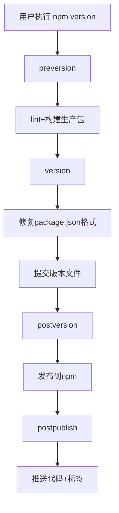

# 概述

## 1. 是什么？

[Rollup >>](https://cn.rollupjs.org/) 是一个用于 JavaScript 的模块打包工具，旨在通过优化打包过程，提高代码的执行效率。与 Webpack 等工具相比，Rollup 特别适合用于打包工具库、组件库以及单一用途的模块，特别是在支持 ES6 模块时，Rollup 可以做到更高效的 Tree Shaking 和更小的输出体积。

## 2. 有何优势？

Rollup 核心优势体现在：

1. **Tree Shaking 优化**

   Rollup 通过 **静态分析** ES6 模块的导入导出关系，自动剔除未使用的代码（如未调用的函数或变量），生成更精简的打包文件。

2. **多格式输出支持**

   支持输出 `ESM`、`CommonJS`、`UMD` 等模块格式，适合库开发和跨环境兼容。

3. **插件生态**

   提供丰富的插件

4. **专注库开发的优化设**

   - 原生支持代码分割（Code Splitting）和按需加载。
   - 通过插件系统（如 @rollup/plugin-node-resolve）实现灵活的依赖解析。
   - 构建速度比 Webpack 快 2-3 倍，特别适合 Monorepo 项目。

## 3. Rollup vs. Webpack

Rollup 和 Webpack 的区别，简单来说：

1. **Tree Shaking**
   - Rollup 采用基于 ES Modules 的 **静态分析**（即在编译时就确定模块的依赖关系），清除更测底。
   - Webpack 采用 **动态分析**（即在运行时根据模块加载的情况来确定依赖关系），支持动态等高级特性，需 配合 package.json 的 sideEffects 标记优化。
2. **输出体积**
   - Rollup 输出体积更小
   - Webpack 输出体积较大（含运行时代码）
3. **适用场景**
   - Rollup 适合库开发
   - Webpack 适合需要复杂功能（如代码分割、热更新）的应用场景
4. **生态扩展性**
   - Webpack 拥有更完善的插件体系
   - Rollup 的插件系统更轻量但功能完整

一句话概括：

- Rollup = **小而精**，专为库优化

- Webpack = **大而全**，适合复杂应用

> 技术选型建议：
>
> 对于库开发者，建议采用 Rollup 作为主要构建工具；对于应用开发者，Webpack 仍是更全面的选择。在现代化构建方案中，Vite 等工具已经实现了两者的优势互补。

> **提示**：
>
> - 如果你想了解主流打包工具对比报告，请参考  [这里 >>](https://bundlers.tooling.report/)
>
> - Rollup 提供了一个演示打包结果的 [在线演练场 >>](https://cn.rollupjs.org/repl/)，大家也可以去试试。

# 配置文件

**`rollup.config.js`**

```js
import { defineConfig } from 'rollup';

export default defineConfig({
  input,     // 入口配置（必需）
  output,    // 输出配置（必需） 
  plugins,   // 插件系统
  external,  // 外部依赖
  watch,     // 监听模式
  cache      // 构建缓存
});
```

> 提示：有关每个选项的详细信息，请参阅 [选项大全 >>](https://cn.rollupjs.org/configuration-options/)

# 常用Plugins

- [rollup](https://www.npmjs.com/package/rollup)：核心库
- [cross-env](https://www.npmjs.com/package/cross-env)：跨环境设置环境变量
- [@rollup/plugin-commonjs](https://www.npmjs.com/package/@rollup/plugin-commonjs)：将CommonJS转为ES模块
- [@rollup/plugin-json](https://www.npmjs.com/package/@rollup/plugin-json)：支持直接导入JSON文件
- [@rollup/plugin-node-resolve](https://www.npmjs.com/package/@rollup/plugin-node-resolve)：解析第三方模块依赖 —— *(!) Unresolved dependencies*


- [@rollup/plugin-eslint](https://www.npmjs.com/package/@rollup/plugin-eslint)：代码质量检查
- [rollup-plugin-filesize](https://www.npmjs.com/package/rollup-plugin-filesize)：显示打包体积
- [rollup-plugin-delete](https://www.npmjs.com/package/rollup-plugin-delete)：构建前清理目录
- [rollup-plugin-progress](https://github.com/jkuri/rollup-plugin-progress)：显示构建进度条
- [rollup-plugin-serve](https://github.com/thgh/rollup-plugin-serve)：开发服务器

- [@rollup/plugin-alias](https://www.npmjs.com/package/@rollup/plugin-alias)：路径别名

- [@rollup/plugin-terser](https://www.npmjs.com/package/@rollup/plugin-terser)：代码压缩

- [@rollup/plugin-replace](https://www.npmjs.com/package/@rollup/plugin-replace)：在 Rollup 打包过程中替换代码中的字符串或表达式（如环境变量、配置参数等）

- [rollup-plugin-delete](https://www.npmjs.com/package/rollup-plugin-delete)：每次打包之前清除输出目录（del）

- [rollup-plugin-generate-package-json](https://www.npmjs.com/package/rollup-plugin-generate-package-json)：生成 package.json 文件

- [rollup-plugin-visualizer](https://github.com/btd/rollup-plugin-visualizer)：可视化分析包内容

- [rollup-plugin-bundle-analyzer](https://github.com/doesdev/rollup-plugin-analyzer)：包体积分析

  

- [@rollup/plugin-babel](https://www.npmjs.com/package/@rollup/plugin-babel)：用于使用 Babel 进行转译

- [@babel/core](https://www.npmjs.com/package/@babel/core)：Babel 核心库

- [@babel/preset-env](https://www.npmjs.com/package/@babel/preset-env)：Babel 预设配置

- [core-js](https://www.npmjs.com/package/core-js)：polyfills，从Babel 7.4.0开始，推荐直接安装 **`core-js`** 即可，处理Promise等语法

- [@rollup/plugin-typescript](https://www.npmjs.com/package/@rollup/plugin-typescript)：用于将 TypeScript 文件编译为 JavaScript

- [@babel/preset-typescript](https://www.npmjs.com/package/@babel/preset-typescript)：TypeScript 预设配置

- [tslib](https://www.npmjs.com/package/tslib)：TypeScript 编译后的 js 代码的运行时库

> **插件选择建议**：
>
> 1. 优先使用Rollup官方维护的 `@rollup/plugin-*` 系列
> 2. 复杂项目建议配合`unplugin` 统一插件系统
> 3. 注意插件顺序：resolve → commonjs → babel → terser
> 4. 常用插件列表参考：[点击前往 >>](https://github.com/rollup/awesome)
> 5. 推荐阅读：[一文入门rollup🪀！13组demo带你轻松驾驭](https://juejin.cn/post/7069555431303020580)

# 实战

接下来，我们将以实操的形式手把手带着大家基于rollup 封装并发布一个 js 库。

## 1. 创建目录结构

```shell
$ mkdir -p rollup-examples/src && cd rollup-examples && touch src/index.ts && pnpm init && code . 
```

目录结构如下：

```
rollup-examples
.
├── src
│	└──	 index.ts
└── package.json
```

> 提示：
>
> - 项目名 **`rollup-examples`** 根据需要修改。
> - 包管理工具使用 **`pnpm`**，至于为什么使用它，推荐阅读 [前端包管理工具演进史：从 npm 到 pnpm 的技术革新 >>](https://juejin.cn/post/7487783643920187428)

## 2. 定义开发规范

### 代码规范检查与修复

使用工具：[ESLint](https://eslint.nodejs.cn/)

1️⃣ 安装 & 配置 ESLint

```shell
$ pnpm create @eslint/config@latest

? How would you like to use ESLint? … 
  To check syntax only
❯ To check syntax and find problems

? What type of modules does your project use? … 
❯ JavaScript modules (import/export)
  CommonJS (require/exports)
  None of these
  
? Which framework does your project use? … 
  React
  Vue.js
❯ None of these

? Does your project use TypeScript? … 
  No
❯ Yes

? Where does your code run? …  (Press <space> to select, <a> to toggle all, <i> to invert selection)
✔ Browser
  Node

eslint, globals, @eslint/js, typescript-eslint
? Would you like to install them now? › No / [Yes]

? Which package manager do you want to use? … 
  npm
  yarn
❯ pnpm
  bun
```

上述操作，将在根目录生成 **`eslint.config.mjs`** 配置文件，内容如下：

```js
import { defineConfig } from 'eslint/config'
import globals from 'globals'
import js from '@eslint/js'
import tseslint from 'typescript-eslint'

export default defineConfig([
  { files: ['**/*.{js,mjs,cjs,ts}'] },
  { files: ['**/*.{js,mjs,cjs,ts}'], languageOptions: { globals: globals.browser } },
  { files: ['**/*.{js,mjs,cjs,ts}'], plugins: { js }, extends: ['js/recommended'] },
  { ignores: ['node_modules/', 'dist/', 'build/', '**/*.test.js'] },
  tseslint.configs.recommended,
  {
    env: { node: true },
    rules: {
      // TODO：你可以在这里添加你自己的规则
    },
  },
])
```

> **提示**：ESLint 规则参考，点击 [这里 >> ](https://eslint.nodejs.cn/docs/latest/rules/)

2️⃣ 设置指令 **`package.json`**

```
{
  "scripts": {
    "lint": "eslint --fix --quiet ."
  }
}
```

- `--fix`：自动修复可修复的代码问题（如缩进、引号等格式问题）
- `--quiet`：仅报告错误（error），忽略警告（warning）
- `.`：检查当前目录及子目录下的所有文件（需配合`--ext`指定文件类型）

### 代码风格 

使用工具：[Prettier](https://prettier.nodejs.cn/)

1️⃣ 安装

```shell
$ pnpm add --save-dev --save-exact prettier
```

2️⃣ 创建配置文件

```shell
$ node --eval "fs.writeFileSync('.prettierrc','{}\n')"
```
```j'sojson
{
  "printWidth": 120,
  "tabWidth": 2,
  "semi": false,
  "singleQuote": true,
  "jsxSingleQuote": false,
  "trailingComma": "all",
  "bracketSpacing": true,
  "objectWrap": "preserve",
  "bracketSameLine": true,
  "arrowParens": "avoid",
  "proseWrap": "always",
  "htmlWhitespaceSensitivity": "css",
  "vueIndentScriptAndStyle": false,
  "endOfLine": "lf",
  "singleAttributePerLine": false
}
```

> **提示**：完整配置参考 [Prettier 官方文档 🔗](https://prettier.nodejs.cn/docs/options)

3️⃣ 创建忽略文件：

```shell
$ node --eval "fs.writeFileSync('.prettierignore','# Ignore artifacts:\nbuild\ncoverage\n')"
```

4️⃣ 集成到编辑器（VSCode）

安装扩展：[Prettier - Code formatter](https://marketplace.visualstudio.com/items?itemName=esbenp.prettier-vscode)

配置编辑：

- 搜索  ***Editor:Default formatter***，将值设置为 ***Prettier - Code formatter***
- 搜索 ***Editor:Format On Save***，☑️ 在保存时格式化文件。

5️⃣ 与 ESLint 配合：使用 [eslint-config-prettier](https://github.com/prettier/eslint-config-prettier) 插件关闭与 Prettier 冲突的 ESLint 规则

```shell
$ pnpm add -D eslint-config-prettier
```

> **`eslint.config.mjs`**

```js
import eslintConfigPrettier from 'eslint-config-prettier'

export default defineConfig([
  ...
  eslintConfigPrettier,
])
```

### Git 规范检查

使用工具： [`commitlint`](https://commitlint.js.org/) + [`husky`](https://typicode.github.io/husky/) + `lint-staged` 

1️⃣  创建 git 仓库，然后在根目录创建忽略文件 `.gitignore`

```shell
$ git init 
```

```ini
# .gitignore

node_modules
dist
build
*.local

logs
*.log


.vscode/*
!.vscode/extensions.json
.idea
.DS_Store
*.suo
*.ntvs*
*.njsproj
*.sln
*.sw?
```

2️⃣ 安装依赖

```shell
$ pnpm add husky lint-staged @commitlint/{cli,config-conventional} -D
```

- `husky`：Git钩子管理（需Node.js v18+）
- `commitlint`：提交信息规范校验（推荐`@commitlint/config-conventional`规则）
- `lint-staged`：仅检查暂存区文件

4️⃣ 初始化 husky

自动创建 `.husky` 目录并设置 Git Hook

```shell
$ pnpm exec husky init
```

5️⃣ 配置 `pre-commit` 钩子

配置 `pre-commit` 钩子，在提交时运行 `lint-staged`，只检查暂存区的文件：

```shell
$ echo "npx lint-staged" > .husky/pre-commit && chmod +x .husky/pre-commit
```

在 `package.json` 中配置 `lint-staged`：

```
"lint-staged": {
  "*.{js,jsx,ts,tsx}": [
    "prettier --write --cache",
    "eslint --fix --quiet"
  ]
},
```

这样，当你执行 `git commit` 时，`lint-staged` 会自动运行 `pnpm lint` 来检查暂存区中的文件。

6️⃣ 配置 `commit-msg` 钩子

配置 `commit-msg` 钩子，检查提交信息是否符合规范：

```shell
$ echo "npx --no-install commitlint --edit \$1" > .husky/commit-msg && chmod +x .husky/commit-msg
```

创建 `commitlint.config.js` 文件来配置 `commitlint`：

```js
echo "export default { extends: ['@commitlint/config-conventional'] };" > commitlint.config.js
```

> 提示：在 package.json 文件中设置 `"type": "module"`

<hr />

现在，当你执行 `git commit` 时，`husky` 会自动触发以下钩子：

- **`pre-commit` 钩子**：运行 `lint-staged`，对暂存区的文件进行代码风格检查。
- **`commit-msg` 钩子**：运行 `commitlint`，检查提交信息是否符合规范。

这样配置后，你的项目将能够在提交时自动进行代码风格和提交信息的检查，确保代码质量和提交信息的规范性。

注意：

1. `lint-staged` 会自动将修改后的文件添加到暂存区，因此不要在 `lint-staged` 配置中显式调用 `git add`。
2. 如果 `pnpm lint` 检查失败，提交会被阻止。请根据错误提示修复代码后重新提交。
3. 如果需要自定义提交信息规范，可以修改 `commitlint.config.js` 文件，添加自定义规则。

📖 扩展：`conventional`  规范

格式：

```
<type>: <subject> → 提交的类型: 摘要信息
```

常用的 `type` 值包括如下:

- feat：添加新功能
- fix：修复 Bug
- chore：一些不影响功能的更改
- docs：专指文档的修改
- perf：性能方面的优化
- refactor：代码重构
- test：添加一些测试代码等等

提交时的代码格式：*`git commit -m "feat: xxx"`*

> 注意：`feat: ` 后面跟一个空格。

### 配置 `tsconfig.json`

```json
{
  "compileOnSave": true,
  "compilerOptions": {
    "target": "ESNext",
    "module": "ESNext",
    "lib": ["ESNext", "DOM", "DOM.Iterable"],
    "strict": true,
    "esModuleInterop": true,
    "useDefineForClassFields": true,

    "moduleResolution": "Node",
    "resolveJsonModule": true,
    "noEmit": true,

    "baseUrl": "./",
    "paths": {
      "@/*": ["src/*"]
    },

    "declaration": true,
    "declarationDir": "dist",

    "sourceMap": true,
    "isolatedModules": true,

    "noUnusedLocals": true,
    "noUnusedParameters": true,
    "noImplicitReturns": false,
    "skipLibCheck": true
  },
  "include": ["src/**/*", "dist"],
  "exclude": ["node_modules", "dist"]
}
```

## 3. 安装依赖

```shell
$ pnpm add cross-env rollup @rollup/plugin-commonjs @rollup/plugin-node-resolve @rollup/plugin-babel @babel/core @babel/preset-env core-js @rollup/plugin-typescript @babel/preset-typescript tslib @rollup/plugin-alias @rollup/plugin-eslint @rollup/plugin-alias rollup-plugin-delete @rollup/plugin-terser rollup-plugin-generate-package-json -D
```

## 4. 配置

### **`package.json`**

```json
{
  "name": "<rollup-examples>",
  "version": "1.0.0",
  "description": "<A modern TypeScript library built with Rollup>",
  "type": "module",
  "main": "./dist/index.cjs.js",
  "module": "./dist/index.esm.js",
  "types": "./dist/index.d.ts",
  "exports": {
    "import": "./dist/index.esm.js",
    "require": "./dist/index.cjs.js",
    "types": "./dist/index.d.ts"
  },
  "files": [
    "dist/**/*",
    "README.md"
  ],
  "scripts": {
    "lint": "eslint --fix --quiet .",
    "prepare": "husky",
    "build:dev": "cross-env NODE_ENV=development rollup --config rollup.config.mjs --bundleConfigAsCjs",
    "build:pro": "cross-env NODE_ENV=production rollup --config rollup.config.mjs --bundleConfigAsCjs"
  },
  "buildOptions": {
    "formats": [
      "iife",
      "cjs",
      "umd",
      "esm"
    ],
    "name": "<module-name"
  },
  "keywords": [
    "typescript",
    "rollup",
    "library"
  ],
  "author": "<Your Name <your.email@example.com>>",
  "license": "ISC",
  "repository": {
    "type": "git",
    "url": "https://github.com/<username>/<rollup-examples>.git"
  },
  "bugs": {
    "url": "https://github.com/<username>/<rollup-examples>/issues"
  },
  "homepage": "https://github.com/<username>/<rollup-examples>#readme",
  "devDependencies": {
    ...
  }
}

```

> **注意**：上述示例中，`name`、`description`、`buildOptions.name`、`keywords`、`author`、`repository`、`bugs` 以及 `homepage` 等字段请根据实际情况修改。

字段简介：

- `name`：包名，唯一标识，由小写英文字母、数字和下划线组成，不能包含空格*（必填项）*
- `version`：包版本号，遵循：`主版本.次版本.修订号` 格式*（必填项）*
- `description`：包的功能描述*（强烈推荐字段）*
- `type`：默认模块类型，可选值：commonjs，module，umd*（强烈推荐字段）*
- `main`：CommonJS 入口，Node.js `require()` 加载的路径，如 `./dist/index.cjs.js`
- `module`：ESM 入口，现代打包工具（如 Rollup）优先使用的路径
- `types`：TS类型声明入口，提供类型提示，入：`./dist/index.d.ts`*（强烈推荐字段）*
- `exports`：条件导出（Node 12+）*（强烈推荐字段）*
  - `import`：ESM 环境
  - `require`：CJS 环境
  - `types`：类型声明
- `files`：发布白名单，指定发布到 npm 的文件，如 `["dist/**/*"]`
- `scripts`：自定义脚本命令
- `buildOptions`：自定义构建配置，非标准字段，通常被构建工具读取：
  - `formats`：输出格式（ESM/CJS/UMD）
  - `name`：UMD 全局变量名
- `keywords`：npm 搜索关键字
- `author`：作者信息，格式：名字 <邮箱> 或对象形式
- `license`：开源协议，常用值：`MIT`/`ISC`/`Apache-2.0`。*（强烈推荐字段）*
- `repository`：代码仓库，Git 地址，如 `https://github.com/xxx.git`
- `bugs`：问题反馈链接，通常指向 issues 页面
- `homepage`：项目主页，文档或官网地址

### `bable.config.json`

```js
{
  "presets": [
    [
      "@babel/preset-env",
      {
        "useBuiltIns": "usage",
        "corejs": 3,
        "modules": false
      }
    ],
    "@babel/preset-typescript"
  ]
}
```

### **`.browserslistrc`** (Options)

`.browserlistrc` 文件是 Autoprefixer、Babel 等前端工具用来确定需要兼容哪些浏览器版本的配置文件，配置内容如下：

```
> 1%             # 全球使用率超过1%的浏览器
last 2 version   # 每个浏览器的最后2个版本
not dead         # 排除已停止维护的浏览器（如IE10以下）
```

> 提示：
>
> - 在项目根目录运行 `npx browserslist` 指令可查询所有与配置匹配的浏览器列表。
> - 访问 [browserslist.dev](https://browserslist.dev) 输入你的配置，可实时查看匹配结果
>
> 你可以在 [这里 >>](https://caniuse.com/usage-table) 查看当前各主流浏览器的兼容性情况，当我们在打包样式和脚本时，将根据这里的配置进行兼容。

### `rollup.config.mjs`

```js
import { readFileSync } from 'fs'
import { defineConfig } from 'rollup'
import { nodeResolve } from '@rollup/plugin-node-resolve'
import { babel } from '@rollup/plugin-babel'
import typescript from '@rollup/plugin-typescript'
import commonjs from '@rollup/plugin-commonjs'
import alias from '@rollup/plugin-alias'
import del from 'rollup-plugin-delete'
import eslint from '@rollup/plugin-eslint'
import terser from '@rollup/plugin-terser'
import generatePackageJson from 'rollup-plugin-generate-package-json'

// -- 工具函数
const resolvePath = filePath => new URL(filePath, import.meta.url).pathname

// -- 变量信息
const isProduction = process.env.NODE_ENV === 'production'
const distPath = resolvePath('dist')
const pkg = JSON.parse(readFileSync(new URL('./package.json', import.meta.url), 'utf8'))

// -- 公共配置
const commonPlugins = [
  del({ targets: 'dist/*' }),
  nodeResolve(),
  commonjs(),
  alias({
    entries: [{ find: '@', replacement: './src' }],
  }),
  eslint({
    include: ['.'],
    exclude: ['node_modules/**'],
    throwOnError: true, // 出现ESLint错误时，打断打包进程
    throwOnWarning: true, // 出现ESLint警告时，打断打包进程
  }),
  typescript({
    tsconfig: resolvePath('tsconfig.json'),
    sourceMap: !isProduction,
  }),
  babel({
    extensions: ['.js', '.ts'],
    exclude: 'node_modules/**',
    babelHelpers: 'bundled',
  }),
  generatePackageJson({
    inputFolder: resolvePath('.'),
    outputFolder: resolvePath('dist'),
    baseContents: pkg => ({
      name: pkg.name,
      description: pkg.description,
      version: pkg.version,
      types: pkg.types,
      main: pkg.main,
      module: pkg.module,
      exports: pkg.exports,
    }),
  }),
]

// -- 开发配置
const devPlugins = []

// -- 生产配置
const proPlugins = [
  terser({
    compress: {
      drop_console: isProduction,
      drop_debugger: isProduction,
    },
    format: {
      comments: (_, comment) => {
        return /eslint\-disable/.test(comment.value) // 不删除eslint的注释
      },
    },
  }),
]

// -- 配置
export default defineConfig({
  input: resolvePath('src/index.ts'),
  output: pkg.buildOptions.formats.map(format => ({
    file: `${distPath}/index.${format}.js`,
    format,
    sourcemap: !isProduction,
    banner: '/* eslint-disable */\n',
    name: ['iife', 'umd'].includes(format) ? pkg.buildOptions.name : undefined,
  })),
  plugins: [...commonPlugins, ...(isProduction ? proPlugins : devPlugins)],
})

```

## 5. 源码

```ts
// src/index.js
export default class vTools {
	/**
	 * SUM：求和
	 * @param a
	 * @param b
	 * @returns
	 */
	static sum(a: number, b: number) {
		return a + b;
	}
}
```

## 6. 打包

```shell
$ pnpm build:pro
```

## 7. 发布

在正式发布之前，建议全局安装 `package-json-validator`，它是一个用于自动检查 `package.json` 文件格式规范性和完整性的 npm 插件，能快速识别缺失字段、无效值或不推荐写法，确保配置符合 npm 发布标准。

```shell
# 安装
$ npm install package-json-validator -g
# 检查
$ pjv
```

没问题之后，执行如下命令进行发布：
```shell
$ npm publish --access public
```

**重要提示**：发布 npm 包时必须使用官方源（https://registry.npmjs.org/），若当前配置为淘宝镜像，需先切换回官方源才能成功发布。

操作步骤：

1. 检查当前源

   ```shell
   $ npm config get registry
   ```

2. 临时切换至官方源

   ```shell
   $ npm config set registry https://registry.npmjs.org/
   ```

3. 发布完成后可回复淘宝源（可选）

   ```shell
   $ npm config set registry https://registry.npmmirror.com
   ```

### 自动发布脚本配置

参考：[【官方】Using-npm Scripts](https://docs.npmjs.com/cli/v11/using-npm/scripts)

```json
{
  "scripts": {
    "preversion": "npm run lint && npm run build:pro",     // 前置检查：代码规范 + 生产构建
    "version": "npm pkg fix && git add package.json package-lock.json",  // 自动修复格式并暂存文件
    "postversion": "npm publish --access public",          // 自动发布到 npm
    "postpublish": "git push origin HEAD --follow-tags && echo '✅ Published!'"  // 安全推送代码和标签
  }
}
```

> 提示：根据需要调整指令，触发指令之后的执行流程为  `preversion` → `version` → `postversion` → `postpublish` 

1️⃣ 触发命令

```bash
$ npm version patch|minor|major  # 选择版本升级类型
```

2️⃣ **自动化流程**



# 深入解析 Rollup 输出格式：前端构建的核心原理

为什么需要掌握 Rollup 的打包格式？随着 Vite.js 在前端工程中的日益普及，这个问题变成了工作生产和面试问答时经常被提及的问题。作为 Vite 构建核心的 Rollup.js，其输出格式直接决定了项目的运行机制。在学习这些工具之前，深入理解 JavaScript 模块化规范至关重要——因为只有明白打包产物的本质和运行原理，才能真正掌握前端构建的精髓。在编程学习中，盲目崇拜工具"魔法"是不可取的，保持对技术原理的好奇心和探索欲，才是持续进步的阶梯。现在，让我们解开神秘的面纱，看看那些打包后的代码，都是些什么玩意儿！

接下来，我们将通过一个完整示例，帮助大家理解模块化规范的几种主要格式。

## 准备工作

首先创建项目并初始化配置：

```shell
$ mkdir rollup-formats && cd rollup-formats && npm init -y  && mkdir src && touch src/{index,answer}.js rollup.config.mjs && pnpm add rollup -D && pnpm add lodash lodash-es jquery && code .
```

项目目录结构如下：

```
rollup-formats
.
├── node_modules
├── src
│   ├── anwser.js
│	  └── index.js
├── package.json
└── rollup.config.js
```

其中 `index.js` 和 `answer.js` 是业务代码，将被作为打包对象。具体代码如下：

> `anwser.js`

```js
export default 30;
```

> `index.js`

```js
import answer from "./answer";
import { repeat } from "lodash";

// -- 定义一个无用变量，测试tree-shaking
const unUsedVar = "Hello, Rollup!";

export const printAnswer = () => {
  // 1. 打印输出
  console.log(`The answer is ${answer}.`);
  // 2. 测试 loadash 的能力，打印30个1
  console.log(repeat("1", answer));
};
```

> `rollup.config.mjs`

```js
import { defineConfig } from "rollup";

export default defineConfig({
  // 外部依赖声明（不打包lodash）
  external: ["lodash"],
  // 入口文件
  input: new URL("src/index.js", import.meta.url).pathname,
  // 多格式输出配置
  output: [
    // IIFE 格式（浏览器直接使用）
    {
      file: "dist/iife/bundle.js",
      format: "iife",
      name: "Test", // 全局变量名
      globals: { lodash: "lodash" }, // 外部依赖全局变量映射
    },

    // CommonJS 格式
    {
      file: "dist/cjs/bundle.js",
      format: "cjs",
    },
    // AMD 格式
    {
      file: "dist/amd/bundle.js",
      format: "amd",
      amd: { id: "Test" }, // 模块ID
    },

    // ESM 格式
    {
      file: "dist/esm/bundle.js",
      format: "esm",
    },

    // UMD 格式（通用模块定义）
    {
      file: "dist/umd/bundle.js",
      format: "umd",
      name: "Test", // 全局变量名
      globals: { lodash: "lodash" },
      amd: { id: "Test" }, // 同时支持AMD
    },

    // SystemJS 格式
    {
      file: "dist/system/bundle.js",
      format: "system",
    },
  ],
});

```

> `package.json`

```json
{
  "name": "rollup-formats",
  "version": "1.0.0",
  "main": "index.js",
  "scripts": {
    "build": "rollup -c --bundleConfigAsCjs"
  },
  "keywords": [],
  "author": "",
  "license": "ISC",
  "description": "",
  "devDependencies": {
    "rollup": "^4.39.0"
  },
  "dependencies": {
    "jquery": "^3.7.1",
    "lodash": "^4.17.21",
    "lodash-es": "^4.17.21"
  }
}
```

执行打包命令：

```shell
$ pnpm build
```

## 模块解读

### 1. IIFE（立即执行函数）

#### 打包结果分析

`dist/iife/bundle.js` 内容

```js
var Test = (function (exports, lodash) {
  "use strict";

  var answer = 30;

  const printAnswer = () => {
    // 1. 打印输出
    console.log(`The answer is ${answer}.`);
    // 2. 测试 loadash 的能力，打印30个1
    console.log(lodash.repeat("1", answer));
  };

  exports.printAnswer = printAnswer;

  return exports;
})({}, lodash);
```

产物分析：

```js
// -- exports 是第一个入参，依赖的 lodash 是第二个入参
var Test = (function (exports, lodash) {
  // -- 自带严格模式，避免一些奇怪的兼容性问题
  "use strict";

  // -- 下面代码因为没有被使用，被 tree-shaking 掉了
  // const unUsedVar = 'Hello, Rollup!';

  // -- 业务中被单一引用的模块，被直接抹平
  var answer = 30;

  const printAnswer = () => {
    // 1. 打印输出
    console.log(`The answer is ${answer}.`);
    // 2. 测试 loadash 的能力，打印30个1
    console.log(lodash.repeat("1", answer));
  };

  // -- 把要export的属性挂在到exports上
  exports.printAnswer = printAnswer;

  return exports;
})({}, lodash);

```

IIFE 是前端模块化早期的产物，其核心思路是：

1. 构建一个匿名函数
2. 立即执行这个匿名函数，外部依赖通过入参形式传入
3. 返回模块输出

#### 运行方式

IIFE 的运行其实很简单，如果它没有其他依赖，只需要去引入文件，然后在 window 上取相应的变量即可，比如 jQuery：

```html
<script src="http://cdn.bootcss.com/jquery/3.3.1/jquery.min.js"></script>
<script>window.$</script>
```

但是如果你像本示例中那样依赖了其他的模块（这里引用了 lodash），那就必须保证以下两点才能正常运行：

1. 依赖包已预先加载
2. 全局变量名与IIFE入参一致

以本示例中 IIFE 构建结果为例：

1. 它前置依赖了 `lodash`，因此需要在它加载之前完成 `lodash` 的加载。
2. 此 `IIFE` 的第二个入参是 `lodash`，作为前置条件，我们需要让 `window.lodash` 也指向 `lodash`。 

因此，运行时，代码如下：

```html
<!DOCTYPE html>
<html lang="zh-CN">
  <head>
    <meta charset="UTF-8" />
    <meta name="viewport" content="width=device-width, initial-scale=1.0" />
    <title>IIFE</title>
    <script src="https://cdn.bootcdn.net/ajax/libs/lodash.js/4.17.21/lodash.min.js"></script>
    <script>window.lodash = window._;</script>
    <script src="../dist/iife/bundle.js"></script>
  </head>

  <body>
    <script>
      window.Test.printAnswer();
    </script>
  </body>
</html>
```

#### 优缺点

- 优点:
  1. 通过闭包创建私有命名空间
  2. 简单易懂
  3. 对代码体积影响小
- 缺点：
  1. 输出的变量可能影响全局变量 / 引入依赖包时依赖全局变量。
  2. 需要手动维护script加载顺序。

优点就不细说了，缺点详细解释一下。

**缺点一：输出的变量可能影响全局变量 / 引入依赖包时依赖全局变量**。

前半句：**输出的变量可能影响全局变量**  其实很好理解，以上面示例的输出为例： `window.Test` 就已经被影响了。这种明显的副作用在程序中其实是有隐患的。

后半句：**引入依赖包时依赖全局变量** 我们为了让示例正常运行，因此加了一行代码让 `window.lodash` 也指向 `lodash`，但它确实是太脆弱了。

```html
<!-- 没有这一行，示例就无法正常运行 -->
<script>window.lodash = window._</script>
```

你瞧，IIFE 的执行对环境的依赖是苛刻的，除非它完全不依赖外部包。（jQuery: 正是在下！）

虽然 IIFE 的缺点很多，但并不妨碍它在 jQuery 时代极大地推动了Web开发的进程，因为它确实解决了 js 本身存在的很多问题。

那么？后续是否还有 **更为优秀** 的前端模块化方案问世呢？当然有，往下看吧。

### 2. CommonJS

#### 打包结果分析

`dist/cjs/bundle.js` 内容：

```js
'use strict';

var lodash = require('lodash');

var answer = 30;

const printAnswer = () => {
  // 1. 打印输出
  console.log(`The answer is ${answer}.`);
  // 2. 测试 loadash 的能力，打印30个1
  console.log(lodash.repeat("1", answer));
};

exports.printAnswer = printAnswer;
```

CommonJS 规范特点：

- 通过 `require` 引入模块
- 通过 `exports` 或 `module.exports` 输出模块

为了解决 Node.js 在模块化上的缺失， **2009年10月**，CommonJS 规范首次被提出。

注意这个关键词： **Node.js**，是的，CommonJS 并不是在浏览器环境运行的规范，而是在 Node.js 环境下运行的。

#### 运行方式

创建测试文件并执行：

```js
// run.js
const Test = require('../dist/cjs/bundle');
Test.printAnswer();
```

```shell
# 执行脚本
node ./examples/run.js

# 输出内容
> The answer is 30.
> 111111111111111111111111111111
```

#### 优缺点

- 优点：完善的模块化方案，解决了 IIFE 的各种缺点。
- 缺点：同步加载，浏览器不支持。

因此，前端界迫切地需要一种能在浏览器环境运行的模块化方案。

### 3. AMD & require.js

2011年，AMD（Asynchronous Module Definition）规范正式发布，为浏览器端带来了成熟的模块化方案。

#### 打包结果分析

`dist/amd/bundle.js` 内容：

```js
define('Test', ['exports', 'lodash'], (function (exports, lodash) { 'use strict';

  var answer = 30;

  const printAnswer = () => {
    // 1. 打印输出
    console.log(`The answer is ${answer}.`);
    // 2. 测试 loadash 的能力，打印30个1
    console.log(lodash.repeat("1", answer));
  };

  exports.printAnswer = printAnswer;

}));
```

关键特性解析：

- **模块定义**：通过全局`define`函数声明模块
- **依赖声明**：数组形式声明外部依赖（`exports`和`lodash`）
- **工厂函数**：接收依赖项作为参数，返回模块实现

require.js 是 AMD 标准实现方案，在使用时，一般遵循以下四步法：

1. 在浏览器内引入 `require.js`
2. 通过 `requirejs.config` 方法定义全局的依赖
3. 通过 `requirejs.define` 注册模块
4. 通过 `requirejs()` 完成模块引入。

#### 运行方式

使用 require.js 加载，你可以在 [这里 >>](https://requirejs.org/docs/release/2.3.6/minified/require.js) 下载

```html
<!DOCTYPE html>
<html lang="zh-CN">
  <head>
    <meta charset="UTF-8" />
    <meta name="viewport" content="width=device-width, initial-scale=1.0" />
    <title>AMD</title>
    <!-- 1. 引入.requirejs -->
    <script src="./requirejs.js"></script>
    <!-- 2. 定义全局依赖 -->
    <script>
      window.requirejs.config({
        paths: {
          lodash: "https://cdn.bootcdn.net/ajax/libs/lodash.js/4.17.21/lodash.min",
        },
      });
    </script>
    <!-- 3. 定义模块 -->
    <script src="../dist/amd/bundle.js"></script>
  </head>

  <body>
    <!-- 4. 消费模块 -->
    <script>
      window.requirejs(["Test"], function (test) {
        test.printAnswer();
      });
    </script>
  </body>
</html>
```

#### 优缺点

- 优点
  1. **异步加载**：避免阻塞页面渲染
  2. **依赖管理**：自动处理模块依赖关系
  3. **路径映射**：支持自定义模块路径

- 缺点：代码组织方式不够直观

但好在我们拥有了各类打包工具，浏览器内的代码可读性再差也并不影响我们写出可读性ok的代码。

现在，我们拥有了**面向 Node.js 的 CommonJs** 和 **面向浏览器的 AMD** 两套标准。

如果我希望我写出的代码能同时被 **浏览器** 和 **Node.js** 识别，我应该怎么做呢？

### 4. UMD 伟大的整合

它没有做什么突破性的创造，但它是集大成者。

它可以在 `<script>` 标签中执行，被 CommonJS 模块加载器加载、被 AMD 模块加载器加载。

#### 打包结果分析

UMD 格式构建出来的代码的可读性进一步降低了，我相信任何正常人看到下面这段代码都会感到一阵头大。

`dist/umd/bundle.js` 内容：

```js
(function (global, factory) {
  typeof exports === 'object' && typeof module !== 'undefined' ? factory(exports, require('lodash')) :
  typeof define === 'function' && define.amd ? define('Test', ['exports', 'lodash'], factory) :
  (global = typeof globalThis !== 'undefined' ? globalThis : global || self, factory(global.Test = {}, global.lodash));
})(this, (function (exports, lodash) { 'use strict';

  var answer = 30;

  const printAnswer = () => {
    // 1. 打印输出
    console.log(`The answer is ${answer}.`);
    // 2. 测试 loadash 的能力，打印30个1
    console.log(lodash.repeat("1", answer));
  };

  exports.printAnswer = printAnswer;

}));

```

UMD 特点：

- 兼容 AMD 和 CommonJS
- 自动判断环境选择加载方式

是的，整整一大段代码，只是在处理兼容性问题，判断当前应该使用AMD还是CommonJS。

因此UMD的代码和实现不在此进行过多分析，它所做的无非便是让同一段代码兼容了AMD和CommonJS规范。

#### 运行方式

与 AMD 和 CommonJS 相同

#### 优缺点

- 优点：跨环境兼容
- 缺点：生成代码冗余

虽然在社区的不断努力下，`CommonJS` 、 `AMD` 、 `UMD` 都给业界交出了自己的答卷。

但很显然，它们都是不得已的选择。

浏览器应该有自己的加载标准。

ES6 草案里，虽然描述了模块应该如何被加载，但它没有 “加载程序的规范”。

### 5. SystemJS

因此，WHATWG（**W**eb **H**ypertext **A**pplication **T**echnology **W**orking **G**roup，即网页超文本应用技术工作小组）提出了一套更有远见的规范：[whatwg/loader](https://github.com/whatwg/loader)。该规范定义了JavaScript模块的加载行为，并提供了拦截加载过程和自定义加载行为的API。作为这一规范的最佳实践者，SystemJS应运而生。

`dist/system/bundle.js` 内容：

```js
System.register(['lodash'], (function (exports) {
  'use strict';
  var repeat;
  return {
    setters: [function (module) {
      repeat = module.repeat;
    }],
    execute: (function () {

      var answer = 30;

      const printAnswer = exports("printAnswer", () => {
        // 1. 打印输出
        console.log(`The answer is ${answer}.`);
        // 2. 测试 loadash 的能力，打印30个1
        console.log(repeat("1", answer));
      });

    })
  };
}));

```

与AMD相比，SystemJS的优势不仅体现在语法上：

1. **按需加载**：通过`System.import()`实现真正的懒加载，避免一次性加载所有bundle
2. **面向未来**：基于WHATWG标准设计，代表模块加载的发展方向
3. **动态能力**：支持运行时模块加载和依赖解析

### 6. ESM

ESM 被认为是 **未来**，但cjs仍然在社区和生态系统中占有重要地位。ESM 对打包工具来说更容易正确地进行 treeshaking，因此对于库来说，拥有这种格式很重要。或许在将来的某一天，你的库只需要输出 esm。

#### 打包结果分析

`dist/esm/bundle.js` 内容：

```js
import { repeat } from 'lodash';

var answer = 30;

const printAnswer = () => {
  // 1. 打印输出
  console.log(`The answer is ${answer}.`);
  // 2. 测试 loadash 的能力，打印30个1
  console.log(repeat('1', answer));
};

export { printAnswer };
```

ESM 特点：

- 原生模块语法
- 静态分析友好

在 ESM 被提出来之前，js 一直没有真正意义上的模块体系。

它的规范是通过 `export` 命令显式指定输出的代码，再通过 `import` 命令输入。

```js
// 导出命令
export { foo };
// 导入模块
import { foo } from 'bar';
```

这也是我们日常开发中最为熟悉的写法，因此，ESM 格式打出来的包，可读性确实非常棒，和阅读我们平时所写的业务代码完全没有区别。

#### 运行方式

现代浏览器直接支持：

```html
<script type="module">
  import { printAnswer } from "../dist/esm/bundle.js";
  printAnswer();
</script>
```

> 提示：
>
> 运行时，你应该会在控制台看到错误信息：
>
> *Uncaught TypeError: Failed to resolve module specifier "lodash". Relative references must start with either "/", "./", or "../".*
>
> 这是因为默认的 lodash 并不是输出的 ESM 格式，为了演示，我们需要调整下 `dist/esm/bundle.js` 代码，如下：
>
> ```js
> - import { repeat } from "lodash";
> + import repeat from '../../node_modules/lodash-es/repeat.js';
> ...
> ```

## 总结：分别适合在什么场景使用？

1. **IIFE** ：适合作为SDK使用，特别是需要挂载到window的场景
2. **CommonJS**： 仅Node.js环境使用的库
3. **AMD**： 纯浏览器端使用

4. **UMD**： 跨浏览器和Node.js环境使用

5. **SystemJs**： 需要动态加载的场景

6. **ESM**：
   - 会被二次编译的库（如组件库）
   - 现代浏览器直接运行
   - 对tree-shaking要求高的场景

随着ESM的普及，未来前端模块化将越来越倾向于使用原生ESM格式。


