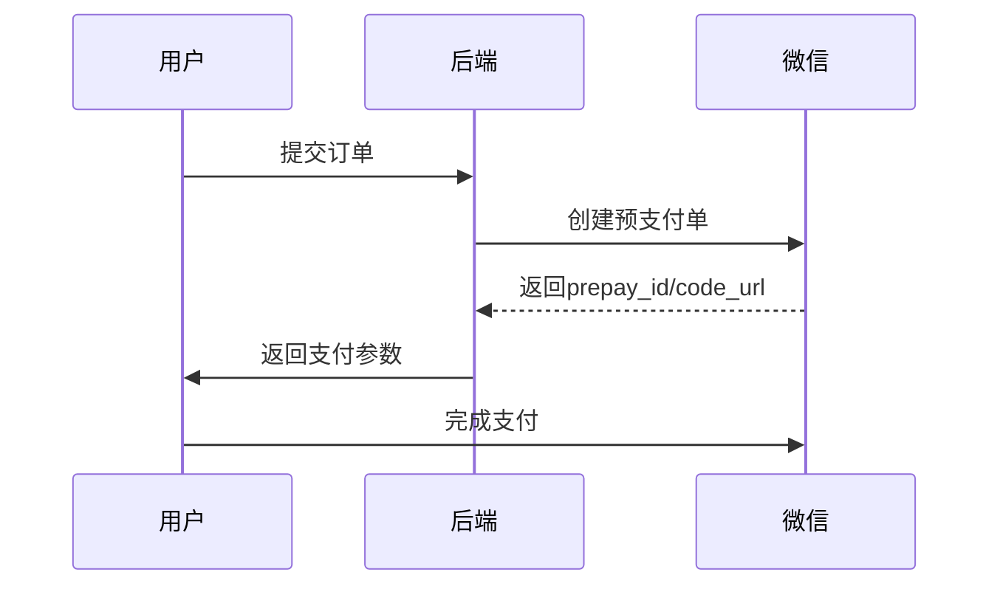

# 前期准备

参考 [微信支付/接入指引 ↪](https://pay.weixin.qq.com/static/applyment_guide/applyment_index.shtml)

## 注册商家

- 前往 [注册微信商户 ↪](https://pay.weixin.qq.com/index.php/apply/applyment_home/guide_normal)

- 所需物料
  1. 超级管理员：姓名，手机号码，邮箱
  2. 营业执照照片（原件，复印件需加盖公章）
  3. 法人信息：身份证人像面/国徽面照片（原件）
  4. 经营与行业信息：商户简称，客服电话，所属行业
  5. 结算账户：银行帐号，开户银行
  6. 法人开户承诺函：[下载模板 ↪](https://kf.qq.com/faq/191018yUFjEj191018Vfmaei.html)
- [费率参照表 ↪](https://kf.qq.com/faq/220228IJb2UV220228uEjU3Q.html)

> 注意：
>
> 1. 所有敏感操作均需超级管理员扫码确认。
> 2. 微信审核费用 300 元

## 注册公众号

## 关联商家/公众号

1. 登录微信商家平台 — 产品中心 — AppID账号管理
2. 登录微信公众平台 — 广告与服务 — 微信支付 — 确认关联

## 开发必要参数准备

@See https://pay.weixin.qq.com/doc/v3/merchant/4013070756

# 后端

## 签名认证

@See https://pay.weixin.qq.com/doc/v3/merchant/4012365336

https://juejin.cn/post/7107083937893056542?share_token=B4986B08-B93E-4C05-AC94-E256D27F4066

1）安装依赖

```shell
$ pip install cryptography wechatpayv3 
$ pip install 'httpx[http2]'
```

## 创建订单




# 前端

# 相关参考

1. [微信支付产品文档 ↪](https://pay.weixin.qq.com/doc/v3/merchant/4012062524)