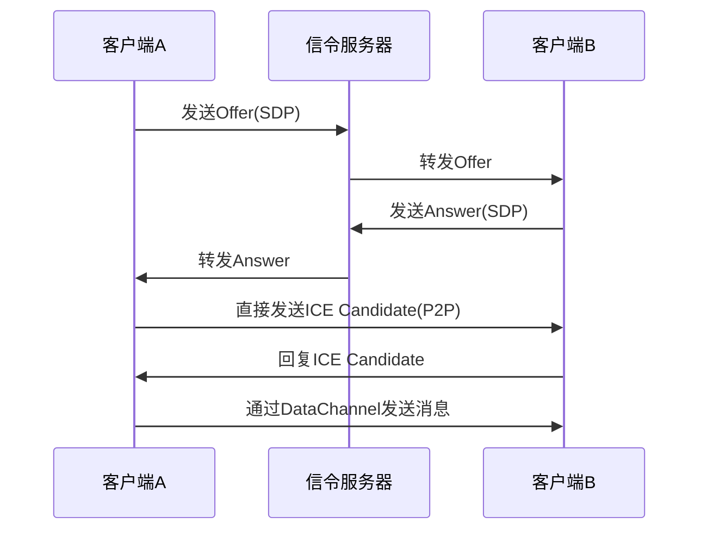

# 概述

[WebRTC >> ](https://developer.mozilla.org/zh-CN/docs/Glossary/WebRTC)（Web Real-Time Communication）是一项支持网页**实时音视频通信和数据传输**的技术，**无需插件或额外软件**，可以直接在浏览器中建立 P2P（点对点）连接，实现高效的数据交换。

WebRTC 的核心 API 主要包括：

1. **MediaStream（getUserMedia）**：获取摄像头、麦克风或屏幕共享的数据流。
2. **RTCPeerConnection**：用于建立 P2P 连接，支持音视频数据传输。
3. **RTCDataChannel**：支持在 P2P 连接中传输任意数据，如文本、文件等。

https://webrtc.p2hp.com/

# WebRTC 使用场景

WebRTC 主要用于**实时通信和数据传输**，常见应用场景包括：

1. **视频通话 / 语音通话**（如 Google Meet、Zoom）
2. **直播互动**（如视频社交、远程教学）
3. **屏幕共享**（如远程协作工具）
4. **P2P 文件传输**（如 WebTorrent、无需服务器的文件共享）
5. **在线游戏 / 低延迟数据传输**（如 Web 游戏中的状态同步）

# WebRTC 示例

## 访问摄像头和麦克风

使用 getUserMedia 访问用户的摄像头和麦克风，并将视频流展示到 video 标签中：

```js
navigator.mediaDevices...
navigator.permissions...
navigator.mediaDevices.getUserMedia({ video: true, audio: true })
  .then((stream) => {
    document.querySelector("video").srcObject = stream;
  })
  .catch((error) => {
    console.error("无法获取媒体设备:", error);
  });
```

## P2P 

WebRTC 建立连接并发送/接收消息的核心流程可分为 **信令交换**、**P2P 连接建立** 和 **数据传输** 三个阶段

### 信令交换（Signaling）

**作用**：通过信令服务器（如 WebSocket）交换 SDP 和 ICE Candidate

```js
// 信令服务器交互（WebSocket）
const signaling = new WebSocket('wss://signaling.example.com');

// 发送 Offer
const sendOffer = async () => {
  const offer = await pc.createOffer();
  await pc.setLocalDescription(offer);
  signaling.send(JSON.stringify({ type: 'offer', sdp: offer.sdp }));
};

// 接收 Answer
signaling.onmessage = async (event) => {
  const data = JSON.parse(event.data);
  if (data.type === 'answer') {
    await pc.setRemoteDescription(new RTCSessionDescription(data));
  }
};
```

### 建立 P2P 连接

#### 初始化 RTCPeerConnection

```js
const pc = new RTCPeerConnection({
  iceServers: [
    { urls: 'stun:stun.l.google.com:19302' },
    { urls: 'turn:turn.example.com', username: 'user', credential: 'pass' }
  ]
});

// ICE Candidate 交换
pc.onicecandidate = (event) => {
  if (event.candidate) {
    signaling.send(JSON.stringify({ type: 'candidate', candidate: event.candidate }));
  }
};
```

#### 媒体流绑定（可选）

```js
// 获取本地媒体流
const stream = await navigator.mediaDevices.getUserMedia({ video: true, audio: true });
stream.getTracks().forEach(track => pc.addTrack(track, stream));
```

### 发送/接收消息

#### 创建 DataChannel

```js
// 发起方创建通道（2025年支持 Promise 语法）
const dc = pc.createDataChannel('chat', {
  ordered: true,  // 保证消息顺序
  maxRetransmits: 3  // 最大重传次数
});

dc.onmessage = (event) => console.log('收到消息:', event.data);
dc.onopen = () => dc.send('Hello WebRTC!');
```

#### 接收方监听通道

```js
// 接收方通过事件监听
pc.ondatachannel = (event) => {
  const remoteDc = event.channel;
  remoteDc.onmessage = (e) => console.log('远程消息:', e.data);
  remoteDc.send('ACK');
};
```

注意：

1. **跨域限制**：WebRTC 本身可跨域，但信令服务器需处理跨域问题

2. **NAT 穿透**：依赖 STUN/TURN 服务器

3. **状态监听**

   ```js
   pc.onconnectionstatechange = () => {
     console.log('连接状态:', pc.connectionState);
   };
   ```

### 关键流程图示



1. **信令阶段**：交换 SDP（Offer/Answer）和 ICE Candidate
2. **连接阶段**：通过 ICE 协议建立 NAT 穿透
3. **通信阶段**：通过 `RTCDataChannel` 直接传输数据

### 完整实例代码

```js
// 初始化连接
const pc = new RTCPeerConnection(config);

// 信令处理
signaling.onmessage = async (e) => {
  const data = JSON.parse(e.data);
  if (data.type === 'offer') await handleOffer(data);
  else if (data.type === 'candidate') await pc.addIceCandidate(data.candidate);
};

// 发送消息
const send = (text) => dc?.readyState === 'open' && dc.send(text);
```

通过以上步骤，即可实现浏览器间的实时音视频或任意数据交换。实际开发中建议使用库（如 `peerjs`）简化流程。

# 总结

WebRTC 提供了一种**高效、低延迟的实时通信方案**，适用于视频通话、P2P 直播、文件传输等场景。完整的 WebRTC 应用通常需要**配合 WebSocket 作为信令服务器**，用于交换 SDP（会话描述协议）和 ICE（网络候选项）信息，以便双方成功建立连接。