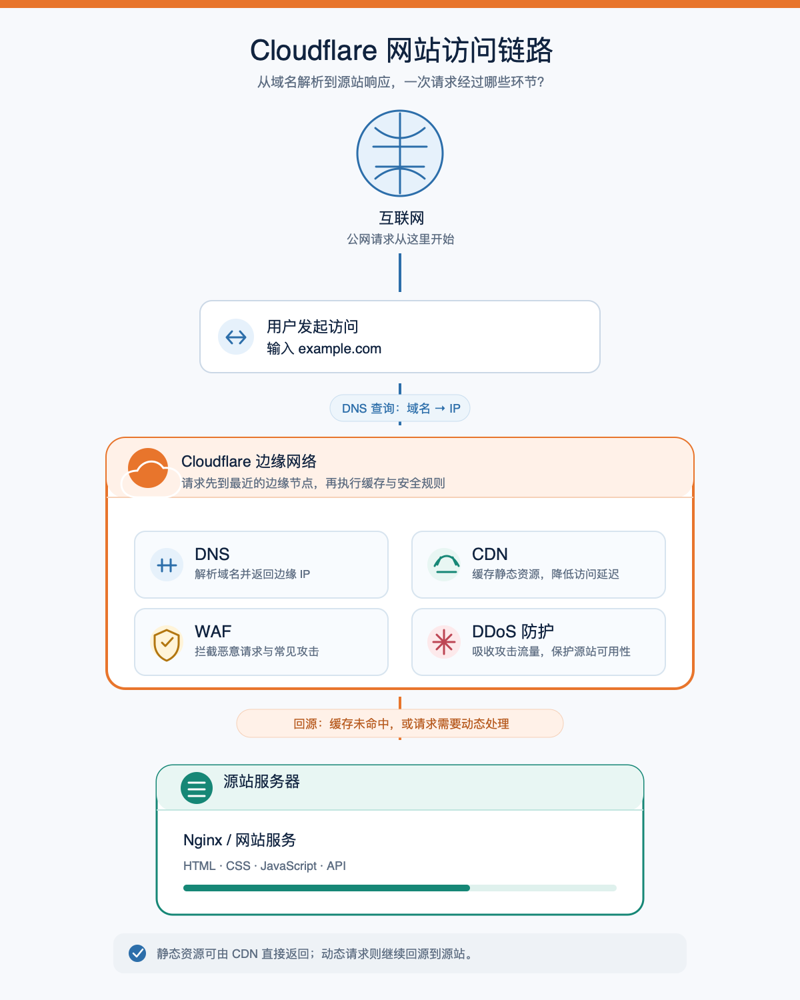

# 概述

[Cloudflare ↪](https://www.cloudflare.com/) 是一家提供互联网基础设施、安全与开发者平台服务的公司。简单来说，它可以作为访问者与源站之间的全球边缘网络：请求先到 Cloudflare 节点，再由其根据规则返回缓存内容或转发到源站。它不仅是 CDN，还整合了 DNS、流量代理、性能优化、安全防护和边缘计算等能力。

最常见的接入方式是将域名 DNS 托管到 Cloudflare，并为需要代理的记录开启“橙云”。此时请求会先进入 Cloudflare，经过 TLS、安全检查、缓存和规则处理后再决定直接响应还是回源；“灰云”则仅使用 DNS，请求直接访问源站。

在性能方面，Cloudflare 可通过 CDN 缓存、压缩、HTTP/2、HTTP/3、智能路由和负载均衡降低延迟、减轻源站压力。但实际效果取决于用户位置、源站位置、缓存规则和内容类型，并非接入后所有请求都会自动变快。

在安全方面，Cloudflare 提供 DDoS 防护、WAF、Bot 管理、速率限制、TLS 证书和访问控制等能力，也提供 Zero Trust、Tunnel 和 Access 等服务，用于保护网站、API、内部应用和网络访问。

Cloudflare 还是一个开发与运行平台。通过 Workers、Pages，以及 R2、KV、D1、Durable Objects、Queues 等服务，开发者可以在 Cloudflare 网络中部署前端、边缘代码和部分完整应用。

因此，Cloudflare 常用于网站加速与防护、DNS 和证书管理、静态站点部署、API 网关、无服务器应用以及 Zero Trust 等场景。需要注意的是，它不能替代源站安全、应用鉴权、备份和高可用设计；错误的缓存、SSL/TLS 或代理配置也可能导致访问异常。

学习 Cloudflare 时，可以先掌握 **DNS → 代理 → 缓存 → 回源** 这条基本链路，再逐步了解安全、性能、Zero Trust 和开发者平台。

# 基础概念

Cloudflare 的功能很多，但理解它不需要从产品列表开始。先从一次最普通的网站访问开始，看看浏览器怎样找到服务器并拿到页面。后面涉及的 DNS、代理、缓存和回源，都建立在这条基础链路上：

```text
用户输入网址
    ↓
DNS 把域名翻译成地址
    ↓
浏览器与服务器建立连接
    ↓
通过 HTTP/HTTPS 请求网页
    ↓
服务器返回 HTML、CSS、JavaScript 等资源
```

最简单的网站访问链路可以画成这样：



这张图先建立整体印象，后文再逐步拆解其中的 DNS、连接和请求。

## URL 与域名

假设我们在浏览器中输入：

```text
https://www.example.com/articles/cloudflare
```

这个地址看起来只是一串文字，但浏览器会把它拆成几个部分：

```text
https://                  协议
www.example.com           主机名
/articles/cloudflare      路径
```

路径表示“想访问网站里的哪一页”，而主机名负责告诉浏览器“应该去找哪台服务器”。真正让网络设备定位服务器的，并不是 `www.example.com` 这样的文字，而是 IP 地址。

## IP 地址

IP 地址可以理解成服务器在互联网中的门牌号。IPv4 地址通常长这样：

```text
203.0.113.10
```

这里使用的 `203.0.113.10` 是文档示例地址，现实中的服务器会有自己的公网 IP。计算机可以根据 IP 找到目标网络，但让人每天记住一串数字并不现实，所以我们才需要域名。

域名和 IP 的关系，可以先记成一句话：**域名方便人记忆，IP 方便网络定位。**

## 域名

域名不是服务器本身，也不是网站文件。它更像是一个“名字”，通过 DNS 记录与某个 IP 地址建立联系。

以 `www.example.com` 为例：

- `com` 是顶级域名；
- `example` 是注册的主域名；
- `www` 是这个域名下的一个主机名，也常被称为子域名。

你可以把 `example.com` 和 `www.example.com` 当成两个不同的地址。它们可以指向同一台服务器，也可以指向完全不同的服务，例如：

```text
example.com        → 网站首页
www.example.com    → 网站首页
api.example.com    → API 服务
mail.example.com   → 邮件服务
```

买域名的地方叫注册商，管理域名解析记录的地方叫权威 DNS 服务商。接入 Cloudflare 时，通常就是把域名的权威 DNS 切换到 Cloudflare，然后在 Cloudflare 控制台中管理这些解析记录。

## DNS

DNS 的全称是 Domain Name System。它做的事情很朴素：把人类可读的域名翻译成计算机可以使用的 IP 地址。

```text
www.example.com
        ↓
       DNS
        ↓
   203.0.113.10
```

严格来说，DNS 不是一台孤零零的服务器，而是一套分布式系统。浏览器、操作系统、路由器和网络服务商都可能缓存解析结果，因此你修改 DNS 后，新的结果不会一定立刻出现在每个用户那里。

一次简化的 DNS 查询大致是这样：

```text
浏览器
  ↓
本机和操作系统缓存
  ↓
递归 DNS 服务器
  ↓
域名的权威 DNS 服务器
  ↓
返回 IP 地址
```

递归 DNS 服务器可以理解成“替你查电话簿的人”。浏览器通常不会自己从头查询整个 DNS 层级，而是把问题交给递归 DNS；递归 DNS 再去询问真正负责这个域名的权威 DNS 服务器。

### DNS 中最常见的记录

#### A 记录

域名指向 IPv4

```text
example.com → 203.0.113.10
```

这是网站最常见的记录类型之一。

#### AAAA 记录

域名指向 IPv6

```text
example.com → 2001:db8::10
```

它和 A 记录的作用类似，只是目标地址是 IPv6。

#### CNAME 记录

一个域名指向另一个域名

```text
www.example.com → example.com
```

它不是直接填写 IP，而是告诉 DNS：查询 `www.example.com` 时，继续参考 `example.com` 的解析结果。很多托管平台会要求你为子域名配置 CNAME。

#### MX 记录

邮件应该送到哪里

```text
example.com → mail.example.com
```

当别人给 `someone@example.com` 发邮件时，邮件系统会通过 MX 记录寻找负责接收邮件的服务器。

#### TXT 记录

放置验证和策略信息

TXT 记录本质上是一段文本，常用于：

- 域名所有权验证；
- SPF、DKIM 等邮件安全配置；
- 第三方服务的接入验证。

这些记录不一定直接服务于网页访问，但以后配置邮箱、统计工具或其他 SaaS 服务时经常会遇到。

## HTTP

DNS 只负责回答“服务器在哪里”，并不负责返回网页内容。浏览器拿到 IP 后，还要和服务器建立连接，然后发送 HTTP 请求。

可以把 HTTP 想成浏览器和服务器之间的一套对话格式。浏览器会说：

```http
GET /articles/cloudflare HTTP/1.1
Host: www.example.com
```

意思是：“请把 `www.example.com` 下的 `/articles/cloudflare` 这份内容给我。”

服务器处理请求后，会返回状态码、响应头和响应正文：

```http
HTTP/1.1 200 OK
Content-Type: text/html
```

常见状态码可以先记住几个：

- `200`：请求成功；
- `301`、`302`：需要跳转到另一个地址；
- `404`：服务器找不到请求的资源；
- `500`：服务器内部发生错误。

网站首页通常只是第一份 HTML。浏览器解析 HTML 后，还会继续请求 CSS、JavaScript、图片和字体，所以打开一个页面往往对应很多次 HTTP 请求。

## HTTPS

HTTPS 可以理解为“运行在 TLS 加密通道中的 HTTP”。它主要解决三个问题：

1. **加密**：别人无法直接看到传输中的内容；
2. **身份认证**：浏览器可以验证当前网站的证书是否匹配这个域名；
3. **防篡改**：传输内容被修改时，浏览器能够发现异常。

因此，`http://example.com` 和 `https://example.com` 并不是同一个访问方式。前者没有使用 TLS 加密，后者会先完成 TLS 握手，再发送 HTTP 请求。

接入 Cloudflare 后，还要进一步理解两段连接：

```text
访问者 ── HTTPS ──> Cloudflare ── HTTPS/HTTP ──> 源站
```

访问者看到的证书通常由 Cloudflare 提供，但 Cloudflare 到源站之间是否加密，则由 SSL/TLS 模式决定。这个问题会在后面的 HTTPS 章节单独展开，这里先记住：**HTTPS 不只是浏览器到 Cloudflare 的连接，源站这一段也需要认真配置。**

## 动手观察

理解概念后，可以用命令行观察一个真实网站。下面的命令只读取信息，不会修改任何配置。

### 查看 DNS 解析结果

```bash
dig +short example.com
```

如果系统没有 `dig`，也可以使用：

```bash
nslookup example.com
```

### 查看 HTTP 响应头

```bash
curl -I https://example.com
```

响应头中通常能看到状态码、服务器类型、缓存策略以及其他信息。以后接入 Cloudflare 后，还可以重点观察 `cf-ray`、`cf-cache-status` 等响应头，用来判断请求是否经过 Cloudflare，以及是否命中缓存。

## 小结

把下面这句话记住，就掌握了这部分的核心：

- 域名是名字，DNS 负责查地址，IP 找到服务器，
- HTTP 负责传输网页，HTTPS 负责让这段传输更安全。

接下来再把 Cloudflare 放进这条链路中：先让 DNS 指向 Cloudflare，再观察请求是直接到源站，还是经过 Cloudflare 的代理、缓存和安全检查。

# 部署源站

前面讲的是浏览器如何找到网站。这一节先把“网站”真正放到一台服务器上，让它能够独立返回页面。

这里使用一台 Ubuntu 服务器，安装 Nginx，并部署一个最简单的静态网站。暂时不接入 Cloudflare，也不配置域名，先用服务器公网 IP 访问。这样做看起来绕了一步，实际上是在给后面的排查打基础：如果源站自己都不能正常返回页面，接入 Cloudflare 之后只会多一层需要排查的环节。

## 准备服务器

你需要准备：

- 一台有公网 IPv4 地址的 Ubuntu 服务器；
- 一个可以通过 SSH 登录的用户，并且拥有 `sudo` 权限；
- 云厂商控制台中的安全组，允许 SSH 的 `22` 端口和 HTTP 的 `80` 端口。

本文继续使用前面的示例地址 `203.0.113.10`。它是专门用于文档的保留地址，不能直接访问；实际操作时，请把它替换成你自己的服务器公网 IP。

先登录服务器：

```bash
ssh root@203.0.113.10
```

如果你使用的是普通用户，把 `root` 换成对应的用户名即可。后面的命令都带有 `sudo`，表示临时使用管理员权限；如果当前已经是 `root`，可以去掉 `sudo`。

## 安装 Nginx

Nginx 是一个常见的 Web 服务器。它可以接收浏览器发来的 HTTP 请求，再从指定目录读取文件并返回给浏览器。现在先只使用它的静态文件服务能力。

更新软件包索引并安装 Nginx：

```bash
sudo apt update
sudo apt install -y nginx
```

安装完成后，启动 Nginx，并设置为开机自动启动：

```bash
sudo systemctl enable --now nginx
```

检查服务状态：

```bash
sudo systemctl status nginx
```

如果看到 `active (running)`，说明 Nginx 进程已经正常运行。按 `q` 可以退出状态查看。

如果服务器启用了 UFW，还需要允许 SSH 和 HTTP 流量：

```bash
sudo ufw status
sudo ufw allow 22/tcp
sudo ufw allow 80/tcp
```

不要在还没有确认 SSH 规则的情况下直接执行 `sudo ufw enable`，否则可能把当前 SSH 连接挡在服务器外。云厂商的安全组和服务器内部的 UFW 是两层独立的防火墙，访问公网网站时，两层都需要允许 `80` 端口。

Ubuntu 安装 Nginx 后通常会自动创建默认站点。此时直接在浏览器中打开：

```text
http://203.0.113.10
```

如果能看到 Nginx 的欢迎页面，说明服务器、网络端口和 Nginx 之间已经打通了。这个页面还不是我们自己的内容，下一步会替换它。

## 创建网站文件

在本文的 Ubuntu 示例中，Nginx 默认从 `/usr/share/nginx/html` 目录提供静态文件。这个目录在安装 Nginx 时通常已经创建好，因此不需要再额外建立网站目录。

创建或修改首页文件：

```shell
$ sudo apt install -y nginx
```

```bash
$ sudo nano /usr/share/nginx/html/index.html
```

把下面的内容粘贴进去：

```html
<!doctype html>
<html lang="zh-CN">
  <head>
    <meta charset="UTF-8" />
    <meta name="viewport" content="width=device-width, initial-scale=1.0" />
    <title>我的第一个源站</title>
  </head>
  <body>
    <h1>源站已经运行</h1>
    <p>这段文字由 Nginx 从源站服务器返回。</p>
  </body>
</html>
```

在 `nano` 中按 `Control + O` 保存，按回车确认文件名，再按 `Control + X` 退出。

这里的 HTML 很简单，但它已经足够完成一次完整的 HTTP 请求：浏览器请求 `/`，Nginx 找到 `index.html`，然后把文件内容返回给浏览器。

> **提示**：你也可以使用如下指令，快速通过 vite 模板打包部署。
>
> ```shell
> $ pnpm create vite learn --template react-ts
> $ pnpm build
> ```

## 配置 Nginx

Nginx 的主配置文件是：

```text
/etc/nginx/nginx.conf
```

打开主配置文件：

```bash
sudo nano /etc/nginx/nginx.conf
```

在 `http {}` 内找到默认的 `server` 配置；如果没有，就在 `http {}` 的最后添加下面这段：

```nginx
server {
    listen 80;
    listen [::]:80;

    server_name _;

    root /usr/share/nginx/html;
    index index.html;

    location / {
        try_files $uri $uri/ =404;
    }
}
```

这段配置可以先这样理解：

- `listen 80`：监听 HTTP 的 `80` 端口；
- `server_name _`：作为默认站点，暂时接收发往这台服务器的请求；
- `root`：网页文件所在的目录；
- `index`：访问目录时默认返回的文件；
- `try_files`：文件存在就返回，不存在就返回 `404`。

这里使用 `server_name _` 是为了先通过公网 IP 验证源站，不要求 DNS 已经配置好。等后面有了真实域名，再把它改成 `example.com www.example.com` 即可。

不同 Ubuntu 镜像的 `nginx.conf` 可能会通过 `include` 引入其他配置文件，例如 `/etc/nginx/sites-enabled/*`。如果文件中已经包含一个监听 `80` 端口的默认 `server`，就直接修改那个已有的配置，不要再添加第二个重复的默认站点；否则可能出现端口或默认站点冲突。

如果想查看 Nginx 最终合并后的完整配置，可以执行：

```bash
sudo nginx -T
```

因此，`/etc/nginx/nginx.conf` 是配置入口，`include` 进来的文件也会影响最终行为；排查时应以 `nginx -T` 展示的生效配置为准。

修改任何 Nginx 配置后，都先检查语法，不要直接重载：

```bash
sudo nginx -t
```

看到下面两行，说明配置检查通过：

```text
... syntax is ok
... test is successful
```

然后让 Nginx 重新加载配置：

```bash
sudo systemctl reload nginx
```

`reload` 会让 Nginx 平滑地读取新配置，通常不会中断已有连接；和它相比，`restart` 会重启整个服务，排查配置时不必优先使用。

## 先在服务器内部测试

不要一上来就打开浏览器反复刷新，先在服务器上确认 Nginx 是否能返回网页：

```bash
$ curl -I http://127.0.0.1
```

正常情况下可以看到类似结果：

```text
HTTP/1.1 200 OK
Server: nginx
Content-Type: text/html
```

`127.0.0.1` 表示当前这台服务器自己。这个请求成功，只能证明 Nginx 和网页文件正常，暂时还不能证明公网访问一定正常。

如果域名还没有配置 DNS，可以使用 `curl --resolve` 临时指定域名和 IP，同时保留正确的 `Host` 请求头：

```bash
curl --resolve example.com:80:203.0.113.10 \
  http://example.com/
```

这个命令不会修改 DNS，它只是告诉 `curl`：“这一次访问 `example.com` 时，直接连接到 `203.0.113.10`。”这对测试 Nginx 的 `server_name` 配置很有用。

## 再从公网测试

确认服务器内部正常后，再从自己的电脑访问：

```bash
curl -I http://203.0.113.10
```

或者直接在浏览器中打开：

```text
http://203.0.113.10
```

如果能看到“源站已经运行”，说明现在已经有了一个可以独立工作的源站。此时请求路径是：

```text
浏览器 ── HTTP ──> 服务器公网 IP ──> Nginx ──> index.html
```

Cloudflare 还没有参与进来，这正是我们想要的结果。

## 访问失败时怎么排查？

可以按照“由近及远”的顺序检查：

| 现象 | 优先检查 |
| --- | --- |
| `curl http://127.0.0.1` 也失败 | `sudo systemctl status nginx`、`sudo nginx -t`、网站目录和文件权限 |
| 服务器内部成功，公网访问超时 | 云厂商安全组、服务器防火墙，以及 `80` 端口是否开放 |
| 看到 Nginx 欢迎页 | 默认站点是否移走，新的配置是否创建软链接并 reload |
| 返回 `404` | `root` 目录是否正确，`index.html` 是否真的存在 |
| 返回 `502` 或 `503` | 当前静态站点通常不应出现，先检查 Nginx 错误日志 |

查看 Nginx 最近的错误日志：

```bash
sudo tail -n 50 /var/log/nginx/error.log
```

这里有一个很实用的判断方法：如果本机 `127.0.0.1` 能访问，公网 IP 不能访问，问题大概率在防火墙或云厂商安全组；如果本机都不能访问，就先不要看 Cloudflare，先修好 Nginx、`root` 目录和网站文件。

## 源站和 Cloudflare 的关系

现在这个源站是“裸奔”的：任何知道公网 IP 的人，都可以直接访问它。下一步接入 Cloudflare 后，正常访问会变成：

```text
用户
  ↓
Cloudflare
  ↓ 回源
源站 Nginx
```

Cloudflare 可以代理、缓存和保护请求，但它不会替你修复一个没有启动的 Nginx，也不会自动生成网站内容。因此，**先让源站独立可用，再接入 Cloudflare**，是最适合初学者的顺序。

下一节再配置 DNS，让 `example.com` 这个名字指向这台服务器，并观察开启和关闭 Cloudflare 代理后的区别。

# 配置域名解析

现在源站已经可以通过公网 IP 访问，但让用户记住 `203.0.113.10` 显然不现实。这一节要做的事情，就是把域名和这台服务器连接起来：让用户输入 `example.com` 时，DNS 能找到源站。

这一步完成后，最初的访问路径会变成：

```text
用户输入 example.com
        ↓
Cloudflare DNS 返回源站 IP
        ↓
浏览器访问 Ubuntu 服务器
        ↓
Nginx 返回网页
```

先不要急着打开橙云。我们先让域名通过 DNS 直接访问源站，确认解析和 Nginx 都没问题，再打开 Cloudflare 代理。每次只改变一个变量，出问题时才知道应该去哪里找。

## 注册商和 DNS 服务商

开始之前，先区分两个经常被混在一起的概念：

- **域名注册商**：负责购买和续费域名，例如你购买 `example.com` 的平台；
- **DNS 服务商**：负责保存 DNS 记录，并回答 `example.com` 对应什么地址。

这两个角色可以是同一家，也可以是不同家。把域名接入 Cloudflare，并不是把域名转移到 Cloudflare，而是把域名的**权威 DNS** 交给 Cloudflare 管理。域名的所有权、续费和注册商账号仍然保持不变。

可以这样理解：

```text
注册商：你租下了这个名字
Cloudflare：负责回答这个名字应该指向哪里
源站：真正保存网页文件的服务器
```

## 将域名添加到 Cloudflare

先登录 [Cloudflare ↪](https://dash.cloudflare.com/) 控制台，选择添加站点，输入你的根域名：

```text
example.com
```

这里不要输入 `https://`，也不要只填写 `www.example.com`。添加的是整个 DNS 区域，之后才能统一管理 `example.com`、`www.example.com`、`api.example.com` 等主机名。

如果只是跟着本文做学习实验，选择免费方案即可。Cloudflare 会尝试扫描原 DNS 服务商中的记录并导入到新的 DNS 页面，但自动扫描并不是绝对可靠，尤其是邮件、验证和第三方服务记录，不能因为网页能打开就认为所有 DNS 都迁移完整了。

在真正切换 Nameserver 之前，先检查 Cloudflare 控制台中的 DNS 记录：

1. 网站 A / AAAA / CNAME 记录
2. 邮件 MX 记录
3. 域名验证 TXT 记录
4. 第三方服务要求的 CNAME 记录

Cloudflare 官方也建议在修改 Nameserver 前先检查记录；如果权威 DNS 切换完成后缺少必要记录，网站或邮箱都可能无法访问。[Cloudflare DNS 入门](https://developers.cloudflare.com/dns/get-started/)

## 修改 Nameserver

添加站点后，Cloudflare 会分配两个 Nameserver，形式大致如下：

```text
xxxx.ns.cloudflare.com
yyyy.ns.cloudflare.com
```

这两个地址是 Cloudflare 为你的域名分配的权威 DNS，不是网站 IP，也不是需要新增到 DNS 记录里的 `A` 记录。你需要打开 [域名注册商↪](https://dc.console.aliyun.com/) 的管理页面，把原来的 Nameserver 替换成 Cloudflare 提供的地址。

通常操作路径类似：

```text
域名管理
  → 在域名列表点击指定域名进入
  → DNS 管理
  → DNS 修改
  → 保存
```

修改的是注册商处的 Nameserver，不是 Cloudflare DNS 页面里的 `A` 记录。保存后，Cloudflare 会等待注册信息更新并验证域名是否已经委派给它。

验证状态可能很快变化，也可能需要更长时间。不要只看本机浏览器的结果，因为浏览器、操作系统和递归 DNS 都可能缓存旧结果。可以用命令行查看当前公开的权威 Nameserver：

```bash
dig NS example.com +short
```

如果输出中出现 Cloudflare 分配的两个 Nameserver，说明委派已经开始生效。也可以直接查询 Cloudflare 是否能回答根域名：

```bash
dig @xxxx.ns.cloudflare.com example.com A
```

把 `xxxx.ns.cloudflare.com` 替换成你实际获得的 Nameserver。这个查询绕过本地递归 DNS，直接询问 Cloudflare 的权威服务器，适合判断 Cloudflare 控制台中的记录是否已经准备好。

Cloudflare 页面显示“已激活”后，才代表 Cloudflare 正式成为这个域名的权威 DNS。激活之前，即使你已经在 Cloudflare 页面里填好了记录，用户的 DNS 查询也可能仍然去往旧的 DNS 服务商。

## 创建网站的 DNS 记录

假设：

```text
域名：example.com
源站 IPv4：203.0.113.10
```

在 Cloudflare 的 DNS Records 页面新增下面两条记录：

| 类型 | 名称 | 内容 | 代理状态 | 作用 |
| --- | --- | --- | --- | --- |
| A | `@` | `203.0.113.10` | DNS only（灰云） | 根域名指向源站 |
| CNAME | `www` | `example.com` | DNS only（灰云） | `www` 指向根域名 |

### `@` 到底是什么？

在 DNS 控制台中，`@` 表示当前域名的根，也就是 `example.com`：

```text
@     = example.com
www   = www.example.com
api   = api.example.com
```

因此，A 记录的名称填 `@`，表示访问 `example.com` 时使用这条记录。名称填 `www`，表示访问 `www.example.com` 时使用这条记录。

### 为什么 `www` 使用 CNAME？

`www` 可以直接再创建一条 A 记录指向同一个 IP，但 CNAME 更容易维护：以后源站 IP 变化时，只需要修改根域名的 A 记录，`www` 会继续跟随 `example.com`。

如果你的 DNS 控制台不接受 `example.com` 作为 CNAME 目标，也可以填写完整域名并保留结尾的点：

```text
example.com.
```

不同控制台的输入格式略有区别，以页面的校验结果为准。

### TTL 先用 Auto

TTL（Time to Live）表示其他 DNS 服务器可以缓存这条记录多长时间。学习阶段建议先使用 `Auto`，不要为了“立刻生效”频繁修改 TTL。TTL 只是缓存时间，不会强制所有网络节点立即刷新；本地缓存、递归 DNS 和注册商状态都可能影响实际生效时间。

### 先保持灰云

灰云表示 DNS only：Cloudflare 只回答 DNS 查询，返回你配置的源站地址，请求不会经过 Cloudflare 的代理。它适合作为这一阶段的验证状态，因为我们可以先确认：域名是否真的找到了 Ubuntu 源站。

灰云的代价也很明确：源站 IP 会公开，CDN、WAF、DDoS 防护和 Cloudflare 的 HTTP 分析都不会作用于这次请求。它只是测试阶段的临时状态，不是生产网站的最终安全方案。[Proxy status 官方说明](https://developers.cloudflare.com/dns/proxy-status/)

## 让 Nginx 认识这个域名

前一节为了用 IP 测试，Nginx 配置使用了：

```nginx
server_name _;
```

这个写法可以接收发往服务器的默认请求，但域名接入后，最好把它改成实际的主机名。编辑主配置文件：

```bash
sudo vi /etc/nginx/nginx.conf
```

把对应的 `server` 配置改为：

```nginx
server_name example.com www.example.com;
```

完整的关键部分如下：

```nginx
server {
    listen 80;
    listen [::]:80;

    server_name example.com www.example.com;

    root /usr/share/nginx/html;
    index index.html;

    location / {
        try_files $uri $uri/ =404;
    }
}
```

保存后检查并重载：

```bash
sudo nginx -t
sudo systemctl reload nginx
```

如果你的 `nginx.conf` 通过 `include` 加载了其他站点文件，就修改实际生效的那个 `server` 块，不要同时保留两个用途相同的配置。可以用下面的命令确认：

```bash
sudo nginx -T | less
```

## 验证灰云直连

先查看两个域名解析到了哪里：

```bash
$ dig +short example.com
$ dig +short www.example.com
```

在灰云状态下，正常情况下应该看到源站 IP，或者 `www` 先返回 CNAME 再解析到源站 IP：

```text
203.0.113.10
```

接着请求网页：

```bash
curl -I http://example.com
curl -I http://www.example.com
```

如果返回 `200 OK`，并且页面内容是前一节创建的“源站已经运行”，说明下面三件事都正常：

1. 域名的权威 DNS 已经切换到 Cloudflare；
2. A / CNAME 记录指向了正确的源站；
3. Ubuntu 的 Nginx 能够根据域名返回网页。

如果想确认请求使用了正确的 `Host`，也可以在还没有等待 DNS 完全更新时使用：

```bash
curl --resolve example.com:80:203.0.113.10 \
  -I http://example.com
```

这个命令只对当前一次请求生效，不会改动 DNS。它很适合区分“DNS 尚未生效”和“源站本身有问题”。

## 从灰云切换到橙云

灰云验证通过后，回到 DNS Records 页面，把网站的两条记录切换为 Proxied，也就是橙云：

```text
example.com        A       203.0.113.10       Proxied
www.example.com    CNAME   example.com        Proxied
```

切换后，请求路径发生了变化：

```text
用户
  ↓ DNS 得到 Cloudflare 地址
Cloudflare 边缘节点
  ↓ 回源
Ubuntu + Nginx
```

再次查询 DNS：

```bash
dig +short example.com
```

这一次通常不会再返回你的源站 IP，而会返回 Cloudflare 的共享 Anycast 地址。浏览器请求仍然使用 `example.com`，但网络连接已经先进入 Cloudflare，再由 Cloudflare 决定是否回源。

用 `curl` 查看响应头：

```bash
curl -I http://example.com
```

如果响应中出现 `cf-ray`，通常可以确认请求经过了 Cloudflare。此时页面仍然可能由源站返回，因为我们还没有配置缓存和 HTTPS；橙云首先改变的是请求路径，并不意味着所有内容都会立刻显示为缓存命中。

Cloudflare 官方建议将提供 Web 流量的 A、AAAA 和 CNAME 记录设为 Proxied；邮箱、域名验证等不属于 HTTP/HTTPS 网站流量的记录，则应保持 DNS only。[代理状态和使用场景](https://developers.cloudflare.com/dns/proxy-status/use-cases/)

## 访问异常时怎么判断？

| 现象 | 优先检查 |
| --- | --- |
| `dig NS example.com` 仍是旧 Nameserver | 注册商处的 Nameserver 是否保存成功，是否仍有旧的 Nameserver |
| 返回 `NXDOMAIN` | Cloudflare 是否已激活，A 记录名称是否填错，根域名是否输入正确 |
| 解析结果不是 `203.0.113.10` | A 记录内容是否正确，是否仍在使用旧 DNS 缓存 |
| 灰云能访问，橙云超时 | Cloudflare 到源站的 `80` 端口、安全组、UFW 和 Nginx 是否正常 |
| 根域名能访问，`www` 不能访问 | CNAME 名称或目标是否正确，Nginx `server_name` 是否包含 `www` |
| 网站正常但邮箱异常 | MX、TXT 等记录是否完整，邮件记录是否被错误删除或代理 |

橙云状态下，如果 Cloudflare 无法连接源站，常见结果是 `521` 或 `522`。这时不要马上修改 DNS，先把记录切回灰云，确认源站公网 IP 仍然可以访问，再检查端口和防火墙。灰云相当于一个很有用的“旁路测试”，但它会暴露源站 IP，因此排查结束后应恢复橙云。

## 这一节完成后的状态

到这里，应该得到一张清晰的配置表：

```text
域名注册商
  └── Nameserver 委派给 Cloudflare

Cloudflare DNS
  ├── @      A       源站 IPv4       橙云
  └── www    CNAME   example.com     橙云

Ubuntu 源站
  └── Nginx 从 /usr/share/nginx/html 返回网页
```

如果还在排查问题，可以暂时把网站记录保持灰云；确认域名、Nginx 和端口都正常后，再切回橙云。下一步就是观察 Cloudflare 的代理请求、HTTPS 和缓存行为，理解“请求到达边缘节点后发生了什么”。

# 缓存与 CDN

橙云打开后，请求已经会先到 Cloudflare，但 “经过 Cloudflare” 和 “命中缓存” 是两件不同的事：

- 经过 Cloudflare：请求先到 Cloudflare 边缘节点
- 命中缓存：边缘节点直接返回已经保存的内容，不再回源

CDN 的价值就在第二件事上。图片、CSS、JavaScript 等静态资源可以放在距离用户更近的边缘节点，后续请求不必每次都从源站重新下载。这样既减少等待时间，也能降低 Ubuntu 服务器的请求压力。

Cloudflare 默认更容易缓存静态文件；HTML、JSON 等动态内容通常不会因为打开橙云就自动缓存。官方文档也建议先理解默认缓存行为，再用 Cache Rules 扩展范围，而不是一开始就对整个网站启用“Cache Everything”。[Cache 入门](https://developers.cloudflare.com/cache/get-started/)

## 先准备一个静态资源

当前首页只有 HTML，先增加一个 CSS 文件，方便观察 CDN 是否缓存静态资源：

```bash
$ sudo mkdir -p /usr/share/nginx/html/assets
$ sudo nano /usr/share/nginx/html/assets/site.css
```

写入：

```css
body {
  max-width: 720px;
  margin: 48px auto;
  padding: 0 20px;
  color: #1f2937;
  font-family: sans-serif;
}
```

然后在 `/usr/share/nginx/html/index.html` 的 `<head>` 中加入：

```html
<link rel="stylesheet" href="/assets/site.css" />
```

CSS 是静态文件，内容不会因为访问者不同而变化，适合用来做第一个缓存实验。修改静态文件后，浏览器可能仍然显示旧版本，这是缓存实验中需要特别留意的现象。

## 用响应头观察缓存

网站记录保持橙云，然后请求 CSS 文件的响应头：

```bash
curl -s -D - -o /dev/null http://example.com/assets/site.css \
  | grep -iE 'cf-ray|cf-cache-status|cache-control'
```

可以重点看两个响应头：

- `cf-ray`：用于标识经过 Cloudflare 的请求；
- `cf-cache-status`：用于说明这次响应与缓存的关系。

常见的状态包括：

```text
MISS       当前边缘节点没有缓存，先回源获取
HIT        当前边缘节点直接返回缓存内容
DYNAMIC    这次响应按动态内容处理，没有使用 CDN 缓存
BYPASS     根据规则或响应头跳过了缓存
```

第一次请求经常是 `MISS`，后续请求可能变成 `HIT`。但缓存是按边缘节点分别存在的：你和朋友从不同地区访问，未必会看到相同的状态；源站响应头、Cookie、查询参数和缓存规则也可能导致请求不缓存。因此不要把一次 `MISS` 当成配置失败。

可以连续请求两次，观察状态变化：

```bash
curl -s -D - -o /dev/null http://example.com/assets/site.css \
  | grep -i cf-cache-status

curl -s -D - -o /dev/null http://example.com/assets/site.css \
  | grep -i cf-cache-status
```

如果两次都没有 `cf-cache-status`，先检查这条 DNS 记录是否为橙云；DNS only 的请求不会经过 Cloudflare CDN。

## 更新文件时为什么还看到旧内容？

假设你修改了 `site.css`，但浏览器看起来没有变化，可能是下面几层缓存中的某一层还保存着旧文件：

```text
浏览器缓存
  ↓
Cloudflare 边缘缓存
  ↓
源站文件
```

学习阶段可以在 Cloudflare 控制台的缓存页面执行按 URL 清除，清除：

```text
https://example.com/assets/site.css
```

清除缓存只会删除 Cloudflare 保存的副本，不会修改 `/usr/share/nginx/html/assets/site.css`。如果你经常更新文件，更推荐给文件名加版本号，例如 `site.v2.css`，而不是每次清空整个站点缓存。

## 暂时不要缓存什么？

初学阶段，下面这些内容不要主动设置为缓存：

- 登录页和后台页面；
- 带用户身份信息的页面；
- 购物车、订单和支付页面；
- 依赖 Cookie 或 `Authorization` 的 API；
- 会根据用户实时变化的 HTML。

缓存的本质是“让多个请求共享一份响应”。如果响应里包含了上一个用户的隐私内容，缓存就可能造成严重的数据泄露。先缓存公开的 CSS、JavaScript、图片和字体，等理解 Cache Rules 后，再单独设计动态页面的缓存策略。

## 这一节应该得到什么结论？

到这里，你应该能区分三种情况：

```text
灰云：DNS 解析到源站，请求不经过 Cloudflare
橙云 + MISS：请求经过 Cloudflare，但需要回源取内容
橙云 + HIT：请求经过 Cloudflare，边缘节点直接返回缓存
```

下一步要解决的是另外一个问题：请求虽然经过了 Cloudflare，但现在仍然可能使用 HTTP。接下来把访问者到 Cloudflare、Cloudflare 到源站的两段连接都讲清楚。

# HTTPS 与 TLS

HTTPS 不只是浏览器地址栏里多了一个小锁。接入 Cloudflare 后，一次 HTTPS 访问实际上包含两段连接：

```text
访问者 ── HTTPS ──> Cloudflare ── HTTPS ──> Ubuntu 源站
```

前一段由 Cloudflare 的边缘证书保护，后一段由源站上的证书保护。只配置前一段，不能代表 Cloudflare 到源站也加密了。

Cloudflare 会为已经激活的域名提供 Universal SSL 边缘证书；但 `Full (strict)` 模式仍然要求源站有一个有效、未过期的证书。[SSL/TLS 入门](https://developers.cloudflare.com/ssl/get-started/)

## 先确认边缘证书

在 Cloudflare 控制台进入：

```text
SSL/TLS
  → Edge Certificates
```

确认 Universal SSL 的状态已经就绪。刚激活的域名可能需要等待证书签发，不要在证书还没有准备好时反复切换 SSL/TLS 模式。

证书签发后，可以先测试访问者到 Cloudflare 这一段：

```bash
curl -I https://example.com
```

如果出现证书错误，先检查域名是否已经激活、网站记录是否为橙云，以及浏览器访问的域名是否包含在证书覆盖范围内。

## 给源站安装证书

为了让 Cloudflare 到 Nginx 之间也使用 HTTPS，给 Ubuntu 源站安装一个公开可信的 Let's Encrypt 证书。先确保：

- `example.com` 和 `www.example.com` 都能解析到当前源站；
- 云厂商安全组允许 `443` 端口；
- Ubuntu 的 UFW 允许 `443` 端口；
- Nginx 当前配置已经包含 `server_name example.com www.example.com`。

开放 HTTPS 端口：

```bash
sudo ufw allow 443/tcp
```

安装 Certbot 和 Nginx 插件：

```bash
sudo apt update
sudo apt install -y certbot python3-certbot-nginx
```

让 Certbot 为两个域名申请证书，并尝试自动修改 Nginx 配置：

```bash
sudo certbot --nginx \
  -d example.com \
  -d www.example.com
```

执行过程中 Certbot 会要求填写邮箱、同意服务条款，并询问是否把 HTTP 重定向到 HTTPS。初次学习时可以先完成证书申请，确认 HTTPS 正常后，再由 Cloudflare 统一处理访问者的 HTTP → HTTPS 跳转。

申请完成后检查 Nginx 配置：

```bash
sudo nginx -t
sudo systemctl reload nginx
```

再从服务器或自己的电脑验证源站 HTTPS：

```bash
curl -I https://example.com
```

如果证书申请失败，不要马上反复执行命令。先检查 DNS 是否仍然指向这台服务器、`80` 端口是否可以从公网访问，以及 Nginx 是否正在监听端口：

```bash
sudo ss -lntp | grep -E ':80|:443'
```

## 选择 SSL/TLS 加密模式

Cloudflare 的 SSL/TLS 模式决定它如何连接源站：

| 模式 | 访问者到 Cloudflare | Cloudflare 到源站 | 适合情况 |
| --- | --- | --- | --- |
| Flexible | HTTPS | HTTP | 临时兼容，不建议作为最终方案 |
| Full | HTTPS | HTTPS，但不严格校验证书 | 源站有证书但暂时无法通过验证 |
| Full (strict) | HTTPS | HTTPS，并校验证书 | 推荐的完整 HTTPS 配置 |

源站证书准备好后，在 Cloudflare 控制台进入：

```text
SSL/TLS
  → Overview
  → Full (strict)
```

`Full (strict)` 是这一阶段的目标。它同时保护两段连接，并验证源站证书是否有效。不要因为浏览器已经显示小锁，就误以为源站这一段已经安全；浏览器只看到了访问者到 Cloudflare 的结果。

如果选择了 `Flexible`，访问者到 Cloudflare 是 HTTPS，但 Cloudflare 到源站仍是 HTTP，源站和中间链路没有得到同等保护。更常见的问题是，源站又强制跳转 HTTPS 时，Flexible 可能形成重定向循环。

## 统一跳转到 HTTPS

确认 `https://example.com` 能正常访问后，可以让 Cloudflare 自动把所有 HTTP 请求跳转到 HTTPS。在控制台进入：

```text
SSL/TLS
  → Edge Certificates
  → Always Use HTTPS
```

打开后，下面的请求通常会得到 `301` 或 `302`，并带有新的 HTTPS 地址：

```bash
curl -I http://example.com
```

Always Use HTTPS 的作用是改变访问者到 Cloudflare 的访问方式，不会替你修复源站证书，也不会自动解决页面中的混合内容。如果 HTML 里仍然写着 `http://` 的图片、脚本或字体地址，浏览器仍可能拦截这些资源。[Always Use HTTPS](https://developers.cloudflare.com/ssl/edge-certificates/additional-options/always-use-https/)

## 证书自动续期

Let's Encrypt 证书有有效期，Certbot 通常会安装自动续期任务。可以先做一次模拟续期检查：

```bash
sudo certbot renew --dry-run
```

看到模拟续期成功，才说明后续续期链路基本可用。证书、443 端口和自动续期要一起考虑，不能只在申请成功当天确认一次。

# 基础安全

网站能访问、能缓存、能使用 HTTPS 之后，再开始接触安全功能。安全配置的第一原则是：先观察真实流量，再逐步增加规则。不要为了“看起来很安全”而一次性打开所有拦截项，否则正常请求被误伤时，很难知道是哪条规则造成的。

## Cloudflare 能保护什么？

当网站记录处于橙云状态时，请求会先经过 Cloudflare。它可以在边缘节点完成一部分 DDoS 防护、WAF 检查、速率限制和 Bot 处理，再决定是否回源。

但 Cloudflare 不是源站的替代品：

- Nginx 仍然需要及时更新；
- 网站后台仍然需要登录鉴权；
- 数据库仍然需要备份；
- 源站仍然需要限制不必要的端口；
- 应用代码仍然需要修复 SQL 注入、越权等问题。

Cloudflare 负责请求经过它时的边缘防护，不能修复源站操作系统和应用本身的漏洞。

## 先查看安全事件

在 Cloudflare 控制台进入网站的安全分析或 Security Events 页面，先观察最近的请求和被处理的事件：

```text
Security
  → Events / Security Events
```

可以按时间、主机名、路径、国家、IP 和处理动作筛选。这里最重要的不是看到很多数字，而是学会回答：

- 哪些请求被拦截或挑战？
- 是哪一个产品或规则处理的？
- 请求访问了哪个路径？
- 这是真正的恶意请求，还是正常用户被误伤？

Cloudflare 的 Security Events 主要展示被安全产品标记或处理的请求；如果想观察所有请求，包括没有触发安全动作的请求，应使用 Security Analytics。[Security Events 官方说明](https://developers.cloudflare.com/waf/analytics/security-events/)

## 使用托管 WAF 规则

WAF（Web Application Firewall）可以把它理解成网站入口处的一组请求检查规则。它会根据请求路径、参数、请求头和请求体等信息，识别常见的 Web 攻击特征。

初学者优先使用 Cloudflare Managed Ruleset，不要一开始手写复杂表达式。进入类似下面的页面：

```text
Security
  → WAF
  → Managed rules
```

确认 Cloudflare Managed Ruleset 已启用。免费计划的能力和规则数量会受计划限制，控制台实际显示的内容以当前账号为准。托管规则由 Cloudflare 维护，会持续更新常见漏洞和攻击特征；官方默认配置会在防护和误报之间做平衡，并不建议无条件打开所有规则。[WAF 入门](https://developers.cloudflare.com/waf/get-started/)

启用后先观察一段时间，再处理被拦截的请求。不要用真实的攻击载荷去“测试 WAF”，普通的页面访问、错误参数和你自己的业务请求已经足够用来确认网站是否受到误拦截。

## 误拦截时怎么处理？

如果某个正常请求被拦截，按下面的顺序处理：

1. 在 Security Events 中找到这次事件；
2. 记录命中的规则、请求路径和触发条件；
3. 判断是请求本身异常，还是规则对你的业务不够了解；
4. 优先为特定路径或特定规则增加例外，不要直接关闭整个 WAF；
5. 修改后重新发起同一个正常请求验证。

例如，某个上传接口可能因为请求体格式被误判。正确的做法是针对这个接口和具体规则建立例外，而不是把所有请求都设置为放行。

## 不要把源站重新暴露出去

橙云可以让普通 DNS 查询返回 Cloudflare 地址，但如果你另外创建了下面这样的记录，源站 IP 仍然会被公开：

```text
origin.example.com  A  203.0.113.10  DNS only
```

如果这个地址和网站使用同一台服务器，攻击者可以绕过 Cloudflare 直接访问源站。学习阶段至少做到：

- 不要为同一台 Web 源站创建不必要的 DNS-only 子域名；
- 邮件、TXT 验证等必须 DNS-only 的记录，不要把它们误认为网站入口；
- 不要把源站 IP 写进前端 JavaScript、公开仓库或错误页面；
- 检查历史 DNS 记录，确认旧的源站地址没有被长期公开。

更进一步的做法是在服务器防火墙中只允许 Cloudflare IP 段访问 Web 端口，但这涉及维护 IP 段列表，规则写错可能导致网站和 SSH 都无法访问。作为初学阶段，先理解“橙云不等于源站自动安全”，暂时不要直接复制复杂防火墙脚本。

## 基础安全检查清单

完成这部分后，可以用下面的清单自查：

```text
[ ] 网站 A / CNAME 记录为橙云
[ ] HTTPS 使用 Full (strict)
[ ] HTTP 会跳转到 HTTPS
[ ] WAF Managed Ruleset 已启用或确认默认状态
[ ] 定期查看 Security Events
[ ] 正常请求没有被误拦截
[ ] 没有额外的 origin.example.com 暴露源站 IP
[ ] Ubuntu、Nginx 和网站依赖保持更新
[ ] 网站和数据库有可恢复的备份
```

这份清单不是“配置完就永远不用看”的勾选表。网站增加后台、API、上传和登录功能后，需要重新检查缓存范围、WAF 误报和源站访问控制。

## 到这里，基本链路已经闭环

现在一次普通访问可以完整地描述为：

```text
用户输入 https://example.com
        ↓
DNS 返回 Cloudflare 地址
        ↓
Cloudflare 建立访问者侧 HTTPS
        ↓
WAF 和其他安全规则检查请求
        ↓
缓存命中则直接返回
缓存未命中则通过 HTTPS 回源
        ↓
Ubuntu Nginx 返回网页
```

到这里，DNS、代理、缓存、回源、HTTPS 和基础安全已经串成了一条完整链路。后面的 Workers、Tunnel、R2、Zero Trust 等产品，都可以放回这条链路中理解，而不必把它们当成互不相关的功能按钮。

# Workers KV

在 Cloudflare 首页的 **Build** 分类中，可以看到 Workers KV。它的全名是 Workers Key Value，也就是 Workers 使用的键值存储。

一句话理解：**KV 用一个 key 保存一个 value，Worker 在靠近用户的 Cloudflare 网络中读取它。**

```text
site-config  →  { "title": "我的博客", "theme": "light" }
```

它不像 MySQL 那样有表、字段和复杂查询，也不像 R2 那样专门保存图片和文件。KV 更像一个分布式的 **配置字典**：你给它一个名字，它返回对应的值。

## KV 适合做什么？

KV 的特点是读得快、读得多，写入相对少。数据写入中心存储后，会在 Cloudflare 网络中按访问情况缓存，后续读取可以直接从靠近用户的节点返回。[KV 的工作方式](https://developers.cloudflare.com/kv/concepts/how-kv-works/)

比较适合的场景：

- 网站配置，例如站点名称、公告、主题开关；
- Feature Flag，例如是否开启新页面；
- 用户偏好，例如语言和界面主题；
- 公开内容的 JSON 缓存；
- 访问频率高、更新频率低的白名单或路由配置。

不太适合的场景：

- 订单、库存、账户余额等必须立即一致的数据；
- 需要复杂条件查询、排序和关联的数据；
- 每秒频繁修改同一个 key 的计数器；
- 图片、视频、压缩包等大文件；
- 需要事务和原子操作的业务。

可以先用下面的方式选择产品：

| 需求 | 更适合的产品 |
| --- | --- |
| 读很多、写较少的配置 | Workers KV |
| 关系型数据和 SQL 查询 | D1 |
| 图片、视频和大文件 | R2 |
| 强一致性、协调和频繁更新 | Durable Objects |

## KV 最容易误解的地方：最终一致性

KV 为了让全球读取速度更快，采用的是**最终一致性**。写入之后，发起写入的 Cloudflare 位置通常很快能读到新值，但其他地区可能在一段时间内读到旧值。官方文档说明，缓存中的旧值可能持续约 60 秒或更久，具体还与缓存状态和 `cacheTtl` 有关。[KV 一致性说明](https://developers.cloudflare.com/kv/concepts/how-kv-works/)

例如，管理员刚把：

```text
site-config → { "maintenance": true }
```

改成维护模式，某些地区的用户可能仍然短暂看到旧配置。这是 KV 的工作特性，不是数据丢失。

因此，KV 很适合“最终会同步到各地”的配置，不适合“写入后所有请求必须立刻读到同一个值”的业务。如果需要强一致性或同一个 key 的高频写入，可以考虑 Durable Objects；如果是订单和用户数据，通常应该使用数据库。

## 先创建一个 KV Namespace

KV 数据保存在 Namespace 中。Namespace 可以理解成一个独立的 KV 容器，一个 Worker 需要先绑定 Namespace，代码才能访问里面的 key。

在 Cloudflare 控制台中操作：

```text
Build
  → Storage & database
  → Workers KV
  → Create namespace（Create Instance）
  → 名称：BLOG_KV
  → Create
```

Namespace 的名称主要用于管理，Worker 代码真正使用的是绑定名称。建议把绑定名称写得明确，例如：

```text
BLOG_KV
```

接着在 Worker 中添加绑定：

```text
Workers & Pages
  → 选择你的 Worker
  → Bindings
  → Add binding
  → KV namespace
  → Variable name：BLOG_KV
  → 选择刚创建的 Namespace
  → Deploy
```

绑定完成后，Worker 代码可以通过 `env.BLOG_KV` 使用这个 Namespace：

```js
const value = await env.BLOG_KV.get("site-config")
```

这里的 `BLOG_KV` 不是环境变量文件中的字符串，而是 Cloudflare 在 Worker 运行时注入的绑定对象。绑定名称必须是合法的 JavaScript 变量名。[KV Binding](https://developers.cloudflare.com/kv/concepts/kv-bindings/)

如果更习惯命令行，也可以用 Wrangler 创建 Namespace：

```bash
npx wrangler kv namespace create BLOG_KV
```

命令执行成功后会返回 Namespace ID。使用本地 Worker 项目时，把它写入 `wrangler.toml`：

```toml
name = "blog-config-api"
main = "src/index.js"
compatibility_date = "2026-08-25"

[[kv_namespaces]]
binding = "BLOG_KV"
id = "替换为实际的 Namespace ID"
```

绑定名称是代码里的 `env.BLOG_KV`，Namespace ID 是 Cloudflare 识别存储空间的 ID，两者不是一回事。

## 写入第一条数据

先准备一份公开的网站配置：

```json
{
  "title": "我的 Cloudflare 博客",
  "notice": "欢迎来到我的网站",
  "theme": "light"
}
```

可以直接在 KV Namespace 的数据页面新增一条记录：

```text
Key:   site-config
Value: 上面的 JSON 内容
```

也可以使用 Wrangler 写入：

```bash
npx wrangler kv key put \
  --binding=BLOG_KV \
  "site-config" \
  '{"title":"我的 Cloudflare 博客","notice":"欢迎来到我的网站","theme":"light"}'
```

如果 JSON 比较长，可以放在文件中：

```bash
npx wrangler kv key put \
  --binding=BLOG_KV \
  "site-config" \
  --path=./site-config.json
```

KV 的 value 可以是普通文本，也可以是 JSON 字符串。Worker 读取时使用 `get(key, "json")`，Cloudflare 会帮我们解析成 JavaScript 对象。[读取 KV 数据](https://developers.cloudflare.com/kv/api/read-key-value-pairs/)

## 用 Worker 暴露一个读取接口

前端不能直接使用 `env.BLOG_KV`，因为这个绑定只存在于 Worker 运行时。正确的链路是：

```text
浏览器
  ↓ fetch()
Worker API
  ↓ env.BLOG_KV.get()
Workers KV
```

在 Worker 编辑器中写入下面的代码：

```js
const ALLOWED_ORIGIN = "https://example.com"

function responseJson(data, status = 200) {
  return new Response(JSON.stringify(data), {
    status,
    headers: {
      "Content-Type": "application/json; charset=UTF-8",
      "Access-Control-Allow-Origin": ALLOWED_ORIGIN,
      "Access-Control-Allow-Methods": "GET, OPTIONS",
      "Access-Control-Allow-Headers": "Content-Type",
    },
  })
}

export default {
  async fetch(request, env) {
    const url = new URL(request.url)

    if (request.method === "OPTIONS") {
      return new Response(null, {
        status: 204,
        headers: {
          "Access-Control-Allow-Origin": ALLOWED_ORIGIN,
          "Access-Control-Allow-Methods": "GET, OPTIONS",
          "Access-Control-Allow-Headers": "Content-Type",
        },
      })
    }

    if (url.pathname !== "/api/site-config" || request.method !== "GET") {
      return responseJson({ error: "Not found" }, 404)
    }

    const config = await env.BLOG_KV.get("site-config", "json")

    if (config === null) {
      return responseJson({ error: "Config not found" }, 404)
    }

    return responseJson(config)
  },
}
```

这段代码做了四件事：

1. 只处理 `GET /api/site-config`；
2. 从 `BLOG_KV` 读取 `site-config`；
3. 用 `"json"` 参数把 KV 中的 JSON 转成对象；
4. 将对象作为 JSON 响应返回给浏览器。

`OPTIONS` 请求是浏览器的 CORS 预检请求。前端和 Worker 使用不同域名时，浏览器可能先发这个请求；返回允许的方法和来源，正式的 `GET` 才能继续执行。

示例中的 `ALLOWED_ORIGIN` 要替换成真正承载前端页面的地址。如果前端本身也运行在这个 Worker 的同一个域名下，可以不需要 CORS；如果只是临时本地开发，可以暂时改成：

```js
const ALLOWED_ORIGIN = "http://localhost:5173"
```

不要在生产环境随意写成 `*`，尤其是接口以后增加登录态或写操作时。允许的来源越宽，任何网站都可能尝试调用你的接口。

## 部署 Worker

在 Worker 编辑器中保存并部署后，会得到一个类似下面的访问地址：

```text
https://blog-config-api.<你的账号>.workers.dev
```

先直接访问接口测试：

```bash
curl https://blog-config-api.<你的账号>.workers.dev/api/site-config
```

正常情况下会得到：

```json
{
  "title": "我的 Cloudflare 博客",
  "notice": "欢迎来到我的网站",
  "theme": "light"
}
```

如果返回 `Config not found`，先检查 key 是否准确写成 `site-config`，以及 Worker 绑定是否命名为 `BLOG_KV`。KV 的 key 区分大小写，`site-config` 和 `Site-Config` 是两个不同的 key。

## 前端如何接入？

前端只需要把 Worker 当成一个普通的 JSON API：

```js
async function loadSiteConfig() {
  const response = await fetch(
    "https://blog-config-api.<你的账号>.workers.dev/api/site-config",
  )

  if (!response.ok) {
    throw new Error(`加载配置失败：${response.status}`)
  }

  return response.json()
}

loadSiteConfig()
  .then((config) => {
    document.title = config.title
    document.querySelector("#notice").textContent = config.notice
  })
  .catch((error) => {
    console.error(error)
  })
```

页面准备一个容器：

```html
<p id="notice">正在加载公告...</p>
```

如果是 Vite 项目，可以把 Worker 地址放在环境变量中：

```bash
# .env.local
VITE_CONFIG_API=https://blog-config-api.<你的账号>.workers.dev
```

代码中使用：

```js
const response = await fetch(
  `${import.meta.env.VITE_CONFIG_API}/api/site-config`,
)
```

环境变量只负责保存公开的 API 地址，不要把 Cloudflare API Token、KV REST API Token 或数据库密码放进去。以 `VITE_` 开头的变量会被打包进前端代码，任何访问网页的人都可以看到。

## 前端能不能直接写 KV？

不建议，也不应该让浏览器直接携带 Cloudflare API Token 写 KV。

如果前端代码中出现这样的内容：

```js
const token = "这里放 Cloudflare API Token"
```

这个 Token 等于公开给所有访问者，攻击者可以用它修改或删除你的 Namespace。正确的做法是：

```text
管理员后台 / CI
  ↓ 带身份验证的请求
Worker
  ↓ 校验用户权限后 env.BLOG_KV.put()
Workers KV
```

对于公开站点配置，写操作可以先使用 Cloudflare 控制台或 Wrangler；对于真正的管理后台，再为 Worker 增加登录校验、权限判断、输入校验和速率限制。前端可以请求“保存配置”的接口，但不能自己决定谁有权限写入。

## KV 的几个使用细节

### 读和写是两个不同的节奏

KV 适合少量写入、大量读取。例如网站公告每天更新几次，几十万次访问都只是读取 `site-config`。如果每个用户点击一次按钮都去修改同一个 key，KV 就不适合做这个计数器。

### key 设计要有规律

不要把所有内容都塞进一个越来越大的 JSON。可以按用途拆分：

```text
site-config
feature:checkout
user-preference:10001
cache:weather:beijing
```

这样读取和失效都更容易控制。用户偏好这类数据还要考虑隐私，不要把密码、支付信息或完整身份资料直接存成公开 API 可以读取的内容。

### value 不是文件存储

KV 单个 value 有大小限制，适合文本和 JSON，不适合拿来存图片、视频和压缩包。大文件放 R2，结构化数据放 D1，KV 只保存轻量的配置或索引。

### 本地开发和线上 Namespace

本地 `wrangler dev` 可以使用本地 KV，也可以配置远程 Namespace。开发和生产最好使用不同的 Namespace，避免本地测试覆盖线上数据。无论使用控制台还是 Wrangler，都要确认当前操作的环境和 Namespace 名称。

## 这一节完成后的状态

完成后，应该能画出这条链路：

```text
浏览器
  ↓ GET /api/site-config
Cloudflare Worker
  ↓ env.BLOG_KV.get("site-config", "json")
Workers KV
  ↓ JSON
Worker 返回响应
  ↓ fetch().then(response.json())
前端页面更新内容
```

Workers KV 的核心不是“把数据库搬到前端”，而是让 Worker 在 Cloudflare 网络中读取一份适合全球分发的键值数据。浏览器始终通过 Worker 访问它，权限、CORS、缓存和业务校验都留在服务端。

# Cloudflare Tunnel

[Cloudflare Tunnel ↪](https://developers.cloudflare.com/cloudflare-one/networks/connectors/cloudflare-tunnel/) 是一种安全地连接本地服务与 Cloudflare 网络的工具。它通过运行在本机的 `cloudflared` 主动向 Cloudflare 建立出站连接，再由 Cloudflare 提供一个公网 HTTPS 入口，将收到的请求转发给本地服务。

```text
Telegram 真机
    ↓ HTTPS
https://xxx.trycloudflare.com
    ↓ Cloudflare Tunnel
http://localhost:5173
```

准确地说，Cloudflare Tunnel 并没有把 `localhost` 本身改成 HTTPS：本地 Vite 服务仍然使用 HTTP，HTTPS 证书与加密由 Cloudflare 入口负责。它也不要求 Mac 拥有公网 IP、开放路由器端口，或者与测试手机处于同一局域网。

这种技术通常被称为**内网穿透**，更准确的说法是“反向隧道”。传统端口映射等待外部访问本机，而 Cloudflare Tunnel 是本机主动连接 Cloudflare，因此可以将原本只能在内网访问的服务安全地暴露出去。

Telegram 正式环境要求 Mini App 使用 [HTTPS URL ↪](https://core.telegram.org/bots/api#webappinfo)。Telegram 测试环境虽然允许使用 HTTP，但需要单独创建测试账号和 Bot，因此在日常真机联调中，使用 Cloudflare Tunnel 通常更方便。

## Quick Tunnel 与 Named Tunnel

Cloudflare Tunnel 主要有两种使用方式：

- **Quick Tunnel**：无需 Cloudflare 账号和域名，执行一条命令即可获得随机的 `trycloudflare.com` HTTPS 地址，适合本地开发和临时测试。
- **Named Tunnel**：需要 Cloudflare 账号和已接入 Cloudflare 的域名，可以绑定固定地址，例如 `miniapp-dev.example.com`，适合长期开发或部署。

本地调试优先使用免费的 [Quick Tunnel ↪](https://developers.cloudflare.com/cloudflare-one/networks/connectors/cloudflare-tunnel/do-more-with-tunnels/trycloudflare/)。它不提供可用性保证，每次重新启动都可能生成新地址，并且存在 200 个并发请求、不支持 SSE 等限制，但这些通常不会影响个人开发。Vite 热更新主要使用 WebSocket，而 Cloudflare 支持代理 WebSocket。

## macOS + Vite + React 本地开发指南

下面使用 VS Code 的两个终端，分别运行 Vite 和 Cloudflare Tunnel。

### 1. 安装 cloudflared

在终端中使用 Homebrew 安装：

```bash
$ brew install cloudflared
```

安装完成后检查版本：

```bash
$ cloudflared --version
```

### 2. 启动 Vite 项目

在 VS Code 的第一个终端中进入项目目录并启动开发服务器：

```bash
$ pnpm run dev
```

Vite 默认使用 `http://localhost:5173`。如果终端显示的是其他端口，后续命令也要改为实际端口。`cloudflared` 与 Vite 运行在同一台 Mac 上，因此这里通常不需要额外配置 `--host 0.0.0.0`。

### 3. 创建 HTTPS 隧道

保持 Vite 运行，在 VS Code 中打开第二个终端：

```bash
$ cloudflared tunnel --url http://localhost:5173
```

连接成功后，终端会输出一个随机地址，例如：

```text
https://example-name.trycloudflare.com
```

先在浏览器中打开该地址进行检查。页面能够正常显示，就说明手机也可以通过这个 HTTPS 地址访问本地 Vite 项目。开发期间需要同时保持 Vite 和 `cloudflared` 两个进程运行，按 `Ctrl + C` 可以停止它们。

### 4. 处理 Vite Host 拦截

如果访问时出现 `Blocked request. This host is not allowed`，说明 Vite 拒绝了外部域名。将终端生成的完整域名加入本次启动允许列表：

```bash
__VITE_ADDITIONAL_SERVER_ALLOWED_HOSTS=example-name.trycloudflare.com npm run dev
```

这里不要填写 `https://`，只填写域名。也不建议将 `server.allowedHosts` 设置为 `true`，否则任意 Host 都能访问开发服务器。Quick Tunnel 地址发生变化后，需要同步替换命令中的域名。

### 5. 配置 Telegram Mini App

打开 Telegram 中的 `@BotFather`，通过 `/setmenubutton`，或者进入 `/mybots` 并选择对应 Bot，为菜单按钮设置刚刚生成的 HTTPS 地址。然后在真机 Telegram 中打开 Bot 并点击菜单按钮，即可加载运行在 Mac 上的 React 页面。

修改 React 代码并保存后，Vite 会通过 WebSocket 推送热更新，Telegram WebView 中的页面通常会自动刷新。如果没有立即更新，可以确认两个终端仍在运行，或者关闭 Mini App 后重新打开。

### 6. 访问本地 API

真机页面中的 `localhost` 指向手机自身，而不是 Mac。同时，HTTPS 页面直接请求本地 HTTP API 还会产生混合内容和跨域问题。如果项目还有本地后端，建议让 React 始终请求 `/api`，再通过 Vite 将其代理到本地后端：

```js
// vite.config.js
import { defineConfig } from 'vite'
import react from '@vitejs/plugin-react'

export default defineConfig({
  plugins: [react()],
  server: {
    proxy: {
      '/api': 'http://localhost:3000',
    },
  },
})
```

这样只需要为 Vite 的 `5173` 端口创建一个 Tunnel，前端页面和 API 都通过同一个 HTTPS 域名访问。

## 注意事项

- Quick Tunnel 地址是公开的，知道地址的人都可以访问，不要在前端代码中存放 Bot Token、密钥等敏感信息。
- 每次生成新地址后，都需要更新 BotFather 中的 Mini App URL；如果频繁更新影响开发效率，可以改用固定域名的 Named Tunnel。
- Telegram WebView 被切换到后台后，系统可能暂停 WebSocket，返回时偶尔需要重新打开 Mini App。
- Tunnel 只解决公网 HTTPS 访问问题，Telegram 传入的 `initData` 仍然需要在服务端校验，不能直接信任前端提交的用户信息。
